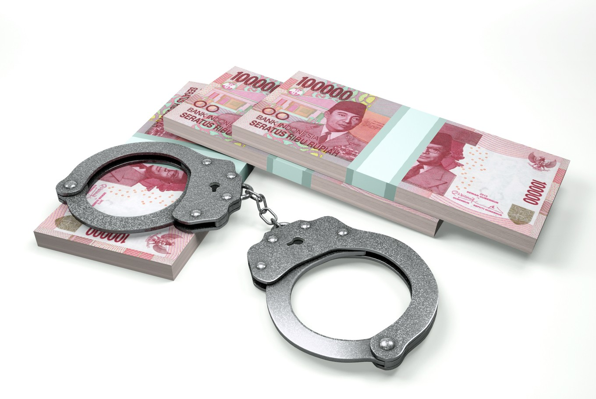

# Hvidvask 1 {-}

# Bekæmpelse af hvidvask og terrorfinansiering<sup><font color="red"> Premium </font></sup>


## Intro til hvidvaskloven

Lov nr. 651 af 8. juni 2017 om forebyggende foranstaltninger mod hvidvask og finansiering af terrorisme (hvidvaskloven) er et regelsæt, som skal sikre, at de virksomheder, som er omfattet af loven, kender deres kunder og de transaktioner, som de foretager. 

Hvidvasklovens formål er at sikre, at Danmark bidrager til den internationale kamp mod hvidvask af penge og finansiering af terrorisme.

---

**Video: Sådan foregår hvidvask?**

<div class="video-container"><iframe src="https://www.youtube.com/embed/67jlG9dPs54" width="853" height="480" frameborder="0" allowfullscreen="allowfullscreen"></iframe></div>

---

 
**Video: Danske Bank Hvidvask/Tæt på sandheden**

<div class="video-container"><iframe src="https://www.youtube.com/embed/1q0K01SQavk" width="853" height="480" frameborder="0" allowfullscreen="allowfullscreen"></iframe></div>

---


### Begrebet "hvidvask"

---

**Video:How does money laundering work? - Delena D. Spann**

<div class="video-container"><iframe src="https://www.youtube.com/embed/257wV-AbKaE" width="853" height="480" frameborder="0" allowfullscreen="allowfullscreen"></iframe></div>


---

Definitionen af ”hvidvask” fremgår af lovens § 3, stk. 1. 

Hvidvask er uberettiget at modtage eller skaffe sig eller andre del i økonomisk udbytte eller midler, der er opnået ved en strafbar lovovertrædelse. 

Lovbestemmelsen beskriver udtrykket »hvidvask«. 

Beskrivelsen tager udgangspunkt i straffelovens § 290 om hæleri. Direktivets definition af hvidvask findes i art. 1, stk. 3.

Efter hvidvasklovens § 3, stk. 2 er hvidvask også uberettiget at skjule, opbevare, transportere, hjælpe til afhændelse eller på anden måde efterfølgende virke til at sikre det økonomiske udbytte eller midlerne fra en strafbar lovovertrædelse. 

Strafbar overtrædelse omfatter både overtrædelse og forsøg på af straffeloven og af speciallovgivningen samt tilsvarende strafbare forhold begået i udlandet.

Hvidvask er at sikre udbytte fra en strafbar handling.

Der kan være tale om penge eller andre værdier, som stammer fra handel med narko, menneskesmugling, våbensmugling, røveri, eller penge som er opnået gennem f.eks. underslæb, skatteunddragelse, bedrageri, korruption eller insiderhandel.


For at kunne bruge udbyttet fra en strafbar handling skal de personer, som har begået handlingen, sørge for at få udbyttet til at se ud, som om at det er erhvervet på lovlig vis.

Derfor skal udbyttets ulovlige oprindelse skjules.

Dette kan f.eks. ske ved at sløre pengenes oprindelse eller ændre pengenes identitet ved f.eks. at veksle til en anden valuta. 

Det kan eksempelvis også ske ved at flytte udbyttet til et sted, hvor det ikke vil få nærmere opmærksomhed.

Hvidvask omfatter både det at skaffe sig selv eller andre del i udbyttet af en strafbar handling. 

Hvidvask omfatter også gerningsmandens egne dispositioner over udbyttet (selvhvidvask).

Af hvidvasklovens § 3, stk. 2, omfatter hvidvask således også gerningsmandens egne dispositioner over udbyttet, der i dansk ret ikke straffes som hæleri, fordi straf for før forbrydelsen udtømmende gør op med strafansvar for også de senere tilknyttede dispositioner. 

Hvidvaskbegrebet i i lovens § 3, stk. 1 omfatter således både handlinger, der er udført af den, der har begået før forbrydelsen (tredjemand), og handlinger udført af gerningsmanden.

Hvidvask er ikke nødvendigvis en kompliceret proces. 

Der er tale om hvidvask fra den første fase, hvor man f.eks. indsætter kontanter på en bankkonto eller veksler til en anden valuta eller køber fast ejendom. 

Det vil eksempelvis også være tilstrækkeligt, at en person kortvarigt tillader en anden person at deponere penge på sin konto eller i en boks.

Det er vigtigt at bekæmpe hvidvask, da denne type kriminalitet gør det vanskeligt at opdage strafbare handlinger. 

Derudover er det stødende for den almindelige retsopfattelse, at kriminelle skal kunne nyde godt af udbytte, der er opnået gennem strafbare handlinger.

En effektiv bekæmpelse af hvidvask vil virke forebyggende for alt økonomisk kriminalitet, da det vil vanskeliggøre kriminelles muligheder for at sikre udbyttet.

---


```{r echo=FALSE}
library(kableExtra)

fr <- data.frame(
  Aktivitet = c(rep("Anbringelse<br><br>Det ulovlige udbytte anbringes, Det kan fx. være i det finansielle system.", 1), rep("Sløring<br><br>Det ulovlige udbytte adskilles fra dets kilde. Det kan f.eks. ske gennem (finansielle) transaktioner.",1 ),rep("Anvendelse<br><br>Udbytte tilbageføres til gerningsrmanden. Det kan f.eks. være i en form, hvor udbyttet er ændret til midler eller aktiver, der ser ud til at være lovlige.",1)),
  EksempelA = c(
    "Indbetaling af kontanter i en bank (evt. blandet med midler fra lovlig virksomhed)",
    "Elektronisk overførsel til udlandet (ofte ved brug af selskaber uden reel aktivitet. eller midlerne maskeres som udbytte fra lovlige forretninger)", 
    "Tilbageførsel som betaling for (fiktive) lån eller betaling af (fiktive) fakturaer"
  ),
  EksempelB = c(
    "Udførsel af kontanter til udlandet",
    "Indsættelse af kontanter i en bank i udlandet ", 
    "Et kompliceret net af overførsler nationalt og internationalt, der gør det næsten umuligt at spore midlernes oprindelige kilde"
  ),
  EksempelC = c(
    "Anvendelse af kontanter til køb af højværdivarer, fast ejendom eller aktiver til erhvervsvirksomhed ",
    "Salg af de købte varer/aktiver", 
    "Indtægt fra fast ejendom eller virksomhed, der fremstår som lovlig"
  )
)
names(fr) <- c("Aktivitet" ,"Eksempel 1" , "Eksempel 2" , "Eksempel 3")
kable(fr,  format = "html", escape = FALSE,caption = "Hvidvask i praksis") %>%
  kable_styling(full_width = T,font_size = 10,bootstrap_options = c("responsive","bordered","striped")) %>%
  column_spec(1, bold = T, border_right = T, color = "white", background = "black") %>%
  row_spec(0,italic = T, color = "white", background = "grey",font_size = 12) %>%
  # column_spec(0, angle = -45)%>%
  # scroll_box(width = "500px") %>%
  scroll_box(width = "100%") %>%
footnote(general = "Hvidvasksekretariatet",general_title = "Kilde: ")
```

---

### Kontantforbud

Hvidvaskloven viderefører det tidligere gældende kontantforbud, jf. lovens § 5. 

Således er det forbudt for »erhvervsdrivende«, der ikke er omfattet af hvidvaskloven, jf. dennes § 1, at modtage kontantbetalinger på 50.000 kr. eller derudover, hvad enten betalingen sker på én gang eller som flere betalinger, der ser ud til at være indbyrdes forbundet.

Bestemmelsen omfatter således ikke private. 

Ikke kun erhvervsdrivendes salg af genstande, men også f.eks. deres levering af tjenesteydelser og salg af fast ejendom er omfattet af forbuddet mod at modtage kontantbetalinger på eller over beløbsgrænsen.

Se Højesteretsdom i U.2019.2445 H om overtrædelse af kontantforbuddet:

**"Hvidvasklovens kontantforbud overtrådt i forbindelse med kontantsalg af brugte biler. T ApS solgte i perioden fra januar 2015 til marts 2016 mere end 500 brugte biler til udenlandske opkøbere mod kontant betaling. I langt de fleste tilfælde var prisen for den enkelte bil under 50.000 kr., men i 19 tilfælde var der sket salg af en enkelt bil til en enkelt kunde, som havde betalt mere end 50.000 kr. kontant for bilen. I ni yderligere tilfælde var der sket kontantsalg af en bil til en pris af mere end 50.000 kr., men i disse tilfælde havde T også solgt andre biler for mindre end 50.000 kr. til samme kunde. I de resterende tilfælde havde T ApS foretaget kontantsalg af flere biler til samme kunde den samme dag, hvor prisen for den enkelte bil var mindre end 50.000 kr., men hvor summen af de kontante beløb havde været større end 50.000 kr. T ApS blev i landsretten idømt en bøde på 190.000 kr. for de 19 tilfælde af salg af en enkelt bil for en kontant betaling af mere end 50.000 kr., men i øvrigt frifundet. Højesteret skulle alene tage stilling til de forhold, hvori T ApS var blevet frifundet. Højesteret fandt, at der også ved salget af de ni biler til en pris af mere end 50.000 kr., men som var solgt sammen med andre biler, var sket en overtrædelse af kontantforbuddet i hvidvaskloven, og idømte T ApS en bøde på 90.000 kr. for disse forhold, jf. hvidvasklovens § 78, stk. 4, jf. stk. 1, jf. § 5. På baggrund af landsrettens bevisbedømmelse, som Højesteret ikke kunne efterprøve, jf. retsplejelovens § 933, stk. 2, jf. § 912, stk. 1, nr. 4, modsætningsvis, lagde Højesteret til grund, at T ApS ikke i videre udstrækning end ved salget af de 28 biler havde modtaget kontant betaling af 50.000 kr. eller derover på én gang eller havde modtaget flere kontantbetalinger på under 50.000 kr., som var eller så ud til at være indbyrdes forbundet på en måde, som indebar overtrædelse af hvidvasklovens kontantforbud. Højesteret stadfæstede herefter landsrettens dom med den ændring, at bødestraffen til T ApS blev forhøjet med 90.000 kr. til 280.000 kr."**

Kontantforbuddet vil således kun ramme betaling af f.eks. leje af hus eller husrum, leje af bil eller levering af vand, varme og gas eller elektricitet, hvis betalingen for en enkelt periode udgør 50.000 kr. eller derover. 

Hvis der derimod er tale om ratevis betaling, eksempelvis i forbindelse med køb af en løsøregenstand eller en fast ejendom eller i forbindelse med betaling for en entrepriseydelse eller en rejse, vil de enkelte rater være indbyrdes forbundne, og kontantforbuddet vil dermed ramme tilfælde, hvor den samlede betaling udgør 50.000 kr. eller derover.


### Falskmøntneri


Det følger af hvidvasklovens § 6, stk. 1, at: 

*virksomheder og personer, der som led i deres virksomhed deltager i håndtering og udlevering af pengesedler og mønter til offentligheden, herunder personer og virksomheder, hvis aktivitet består i at veksle pengesedler og mønter i forskellig valuta, har pligt til at tage alle sedler og mønter, som de ved eller har grund til at tro er falske, ud af omløb. Sedler og mønter, der er taget ud af omløb i overensstemmelse med 1. pkt., skal straks overgives til politiet*.

Lovens bestemmelser er svarende til Rfo 1338/2001 om fastlæggelse af de foranstaltninger, der er nødvendige for at beskytte euroen mod falskmøntneri (offentliggjort i EFT 2001 L 181/6), samt Rfo 1339/2001, der udvider bestemmelserne i ovennævnte forordning 1338/2001 til også at gælde for EU-lande uden for eurosamarbejdet, herunder Danmark (offentliggjort i EFT 2001 L 181/11). 

Forordninger gælder umiddelbart i hver medlemsstat. Gengivelsen af forordningen i loven er alene begrundet i praktiske hensyn og berører ikke forordningens gyldighed i Danmark. 

Overtrædelse af pligten til at tage falske penge ud af omløb anses for omfattet af straffelovens §§ 166-170 om forbrydelser vedrørende penge.


## Kriminalitetsforebyggelse i de finansielle virksomheder

---

**Video: Hvidvask-skandalen: Så mange advarsler fik Danske Bank**

<div class="video-container"><iframe src="https://www.youtube.com/embed/b94ktmFWP6c" width="853" height="480" frameborder="0" allowfullscreen="allowfullscreen"></iframe></div>


---

Hvidvasklovens overordnede formål er, at Danmark bidrager med reguleringsmæssige tiltag, der kan styrke indsatsen mod, at kriminelle misbruger danske virksomheder og det finansielle system til hvidvask af penge og terrorfinansiering, og at forhindre, at den finansielle stabilitet og tilliden til det finansielle system skades som følge af misbrug af finansielle institutioner til hvidvask og finansiering af terrorisme.^[Følgende afsnit bygger på Finanstilsynets vejledning om lov om forebyggende foranstaltninger mod hvidvask og finansiering af terrorisme (hvidvaskloven) af oktober 2018.] 

Hvidvask af penge og finansiering af terrorisme foregår ofte i internationalt regi, og hvidvaskloven gennemfører derfor dele af de seneste internationale standarder fra Financial Action Task Force (FATF) fra 2012 og dele af Europa-Parlamentets og Rådets direktiv 2015/849/EU af 20. maj 2015 om forebyggende foranstaltninger mod anvendelse af det finansielle system til hvidvask af penge eller finansiering af terrorisme (herefter 4. hvidvaskdirektiv).


De virksomheder og personer, der til dagligt håndterer pengeoverførsler og andre finansielle transaktioner, er væsentlige aktører i kampen mod hvidvask og terrorfinansiering. 

Der påhviler dem således et stort samfundsansvar med henblik på at begrænse risikoen for, at de bliver udnyttet til hvidvask af ulovlige midler eller terrorfinansiering. 

Med henblik på at sikre, at dette ikke sker, har virksomhederne og personerne et ansvar for og en pligt til at gennemføre de rette foranstaltninger for at forhindre, at de misbruges til hvidvask og terrorfinansiering.

---


---

Med hvidvaskloven ændres den tidligere gældende regulering fra at være primært regelbaseret til at blive mere *risikobaseret*. 

Hermed sikres grundlaget for en mere målrettet og effektiv indsats baseret på en risikobaseret tilgang til bekæmpelse af hvidvask- og terrorfinansiering hos både myndigheder og omfattede virksomheder og personer.

Ved at hvidvaskreglerne ændres til at være mere risikobaserede, sættes rammerne for et mere fleksibelt system, der giver virksomhederne mulighed for at fokusere indsatsen mod de egentlige risikoområder. 

Virksomheder og personer skal herefter individuelt vurdere, om et kundeforhold kan kategoriseres som henholdsvis begrænset, almindelig eller øget risiko. 

Det overlades således til erhvervslivet at identificere og håndtere risici, så disse har mulighed for at prioritere ressourcer til områder med øget risiko for hvidvask eller finansiering af terrorisme. 

Dog opretholdes identificerede højrisikoområder.

Et *risikobaseret system* medfører også, at tilsynsmyndighederne efter loven skal udøve et risikobaseret tilsyn. 

Dette betyder blandt andet, at der ved udførelse af tilsynet skal tages hensyn til det skøn, som den enkelte virksomhed eller person overlades i medfør af hvidvaskloven.

Hvidvaskloven indfører en *opmærksomhedspligt*, som består i, at de af loven omfattede virksomheder og personer generelt skal være *opmærksomme på kundernes aktiviteter*, som på grund af deres særlige karakter menes at kunne have tilknytning til hvidvask eller finansiering af terrorisme.

Hvidvaskloven stiller skærpede krav i forhold til den tidligere hvidvasklov for så vidt angår de af loven omfattede virksomheders og personers kendskab til deres kunder. 

Hvidvaskloven stiller krav om legitimation af kunderne med henblik på identifikation af disse med navn og cpr-nr./cvr-nr., herunder stiller hvidvaskloven krav om *kendskab til virksomhedskunders fysiske ejerkreds med kontrollerende indflydelse (reelle ejere) over disse*. 

Endvidere skal der indhentes oplysninger om kundens formål med *forretningsforbindelsen* samt om omfanget heraf, ligesom *kundeforholdet* løbende skal overvåges.

Hvidvaskloven giver mulighed for at foretage *legitimationsproceduren*, herunder tilvejebringelse af *kundekendskabet*, ud fra en risikobaseret tilgangsvinkel, således at der ikke i alle tilfælde stilles de sammen krav dertil.

Hvidvaskloven stiller dog skærpede krav til *kundekendskabet* ud fra en vurdering af, at der i visse tilfælde er en særlig risiko for hvidvask eller terrorfinansiering. 

De skærpede krav gælder især over for kunder, der er såkaldte *politisk udsatte personer*, dvs. personer, som er bosiddende i udlandet og bestrider eller har bestredet højere politiske poster. 

De øgede krav gælder også i tilfælde, hvor kunden ikke har været fysisk til stede for at legitimere sig samt over for korrespondentbanker i lande uden for EU.

Hvidvaskloven giver mulighed for at undtage fra kravene til legitimation og kundekendskab, hvor risikoen for hvidvask og terrorfinansiering vurderes at være lille. 

Endvidere giver loven mulighed for under særlige betingelser at benytte sig af identitetsoplysninger mv., der er indhentet af tredjemand.

*Underretningspligten er udvidet* i forhold til den tidligere lov på den måde, at de af loven omfattede virksomheder og personer ikke kun skal underrette Statsadvokaten for Særlig Økonomisk og International Kriminalitet ved mistanke om, at en transaktion har tilknytning til overtrædelse af straffeloven. 

Der skal også ske underretning ved mistanke om overtrædelse af særlovgivningen. 

Underretningspligten er dog begrænset til overtrædelser, der kan straffes med fængsel i over ét år.

Tilsynet med de personer og virksomheder, der er omfattet af hvidvaskloven, er delt mellem Finanstilsynet, Erhvervsstyrelsen og Advokatrådet.

## Hvem er omfattet af hvidvaskloven

Efter hvidvasklovens § 1, stk. 1, nr. 1, er pengeinstitutter omfattet af lovens anvendelsesområde. 

*Pengeinstitutter* er virksomheder, der udøver virksomhed, som består i at modtage indlån eller andre midler fra offentligheden, der skal tilbagebetales, samt i at yde lån for egen regning. 

Sådanne virksomheder skal have tilladelse som pengeinstitut i henhold til § 7 i lov om finansiel virksomhed.

*Realkreditinstitutter* er omfattet af lovens anvendelsesområde, jf. lovens § 1, stk. 1, nr. 2. 

Realkreditinstitutter er virksomheder, der yder lån mod registreret pant i fast ejendom på grundlag af udstedelse af realkreditobligationer og særligt dækkede realkreditobligationer eller særligt dækkede obligationer. 

Sådanne virksomheder skal have tilladelse som realkreditinstitut i henhold til § 8 i lov om finansiel virksomhed.

*Fondsmæglerselskaber* er omfattet af lovens anvendelsesområde, jf. § 1, stk. 1, nr. 3. 

Fondsmæglerselskaber er virksomheder, der over for tredjemand udøver aktiviteter, som omfatter værdipapirer i nærmere angivet omfang, og som ikke har tilladelse som pengeinstitut, realkreditinstitut eller *investeringsforvaltningsselskab*. 

Sådanne virksomheder skal have tilladelse som *værdipapirhandler* i henhold til § 9 i lov om finansiel virksomhed.

Efter hvidvasklovens § 1, stk., 1, nr. 4, er *livsforsikringsselskaber og tværgående pensionskasser* omfattet af lovens anvendelsesområde. Sådanne virksomheder skal have tilladelse som forsikringsvirksomhed i henhold til § 11 i lov om finansiel virksomhed. 

Det er alene livsforsikringsselskabernes og de tværgående pensionskassers livs- og pensionsforsikringer, der er omfattet af loven. 

Selv om der siden 1995 har været hjemmel for livsforsikringsselskaber til at tegne forsikringer inden for skadesforsikringsklasserne 1 og 2, dvs. syge- og ulykkesforsikringer, er tegning af disse forsikringer ikke omfattet.

Tværgående pensionskasser er i § 304 i lov om finansiel virksomhed defineret som foreninger eller sammenslutninger, hvis medlemmer enten er uddannet inden for bestemte uddannelsesområder eller er ansat i virksomheder af en bestemt art, og som har til formål som led i ansættelsesvilkårene eller som led i en anden tilknytning til en virksomhed at sikre pension efter ensartede regler for alle medlemmerne, eller hvis medlemmer er selvstændige erhvervsdrivende inden for samme branche, og som har til formål at sikre pension efter ensartede regler for alle medlemmer. 

Sådanne virksomheder skal have tilladelse efter lov om finansiel virksomhed og behandles i det væsentlige efter samme regler som forsikringsselskaber, der driver livsforsikringsvirksomhed.

Efter hvidvasklovens § 1, stk. 1, nr. 5, er *sparevirksomheder* omfattet af lovens anvendelsesområde. Sparevirksomheder udøver virksomhed, som består i erhvervsmæssigt eller som et væsentligt led i deres drift at modtage indlån eller andre midler, der skal tilbagebetales fra offentligheden. 

Sådanne virksomheder skal have tilladelse som sparevirksomhed i henhold til § 334 i lov om finansiel virksomhed, hvis virksomheden ikke har tilladelse som pengeinstitut, realkreditinstitut eller *investeringsforvaltningsselskab* eller er oprettet i henhold til særlig lov, eller hvis oprettelse ikke er godkendt i henhold til særlig lov.

*Udbydere af betalingstjenester og udstedere af elektroniske penge* er omfattet af lovens anvendelsesområde, jf. § 1, stk. 1, nr. 6. Udøvelse af denne type virksomhed kræver tilladelse i henhold til betalingslovens § 9.  

En betalingstjeneste er f.eks. en tjeneste, der muliggør, at kontantbeløb placeres på en betalingskonto, og alle transaktioner, der er nødvendige for drift af en betalingskonto. 

*Pengeoverførselsvirksomhed er også en betalingstjeneste*. 

Ved *elektroniske penge* forstås en elektronisk eller magnetisk lagret pengeværdi, der repræsenterer et krav på udstederen, som udstedes ved modtagelse af betaling af midler medhenblik på at gennemføre betalingstransaktioner, og som accepteres som betalingsmiddel af andre end udstederen af elektroniske penge. 

Det omfatter blandt andet bredt anvendelige gavekort og forudbetalte kort, f.eks. til offentlig transport.

Efter lovens § 1, stk. 1, nr. 7, er *forsikringsmæglere* omfattet, når de formidler livsforsikring eller andre investeringsrelaterede forsikringer, er omfattet af lovens anvendelsesområde. 

*Forsikringsmæglervirksomhed* defineres i henhold til lov om forsikringsmæglervirksomhed som den aktivitet, der består i at yde kunden rådgivning på basis af en analyse af et så stort antal af de på markedet disponible forsikringsløsninger som muligt, og den aktivitet, der består i at præsentere kunden for forsikringsløsninger fra et eller flere forsikringsselskaber, uden at der er indgået udtrykkelig aftale med forsikringsselskaberne herom. 

Forsikringsmæglere skal have tilladelse i henhold til § 4 i lov om forsikringsformidling. 

Forsikringsmæglere er kun omfattet af hvidvaskloven, når de formidler livsforsikring eller andre investeringsrelaterede forsikringer.

I hvidvasklovens § 1, stk. 1, nr. 8, er øvrige virksomheder og personer, der erhvervsmæssigt udøver aktiviteter som nævnt i lovens bilag 1, omfattet af lovens anvendelsesområde. 

Virksomheder og personer, der er omfattet af nr. 8, er forpligtet til at lade sig registrere hos Finanstilsynet, som betingelse for at kunne udøve den nævnte virksomhed. 

Det er karakteristisk for denne type af erhvervsmæssig virksomhed, at der ikke i henhold til lov om finansiel virksomhed eller anden finansiel regulering er et krav om tilladelse, men at aktiviteten er omfattet af 4. hvidvaskdirektivs definition af *finansieringsinstitut*. 

Det er ikke en forudsætning, at aktiviteten udøves som hovedaktivitet, men der skal være tale om erhvervsmæssig virksomhed. 

Ved *erhvervsmæssig* skal forstås, at aktiviteten i denne sammenhæng udbydes til tredjemand, eller at aktiviteten i øvrigt antager et sådant omfang, at der bliver tale om en ikke ubetydelig del af virksomhedens omsætning. 

Det vil alene være aktiviteten, som nævnt i lovens bilag 1, der er omfattet af lovens anvendelsesområde. 

I det omfang der i øvrigt udøves anden aktivitet, som f.eks. en udbyder af finansiel leasing, der også udbyder operationel leasing, vil udbuddet af operationel leasing ikke være omfattet af hvidvasklovens anvendelsesområde. 

Nr. 8 omfatter bl.a. *factoringselskaber, leasingselskaber, kreditkortselskaber og forbrugerkreditselskaber*. 

I sjældne tilfælde vil en virksomhed ikke have mere end én kunde. Dette er i praksis set i tilfælde, f.eks. hvor en virksomhed alene er oprettet til at foretage finansiel leasing til virksomhedens reelle ejer. 

I sådanne tilfælde, hvor der alene er én kunde, der samtidigt er virksomhedens reelle ejer, ses det ikke hensigtsmæssigt at omfatte virksomheden af lovens anvendelsesområde, og en sådan virksomhed eller person vil heller ikke være registreringspligtig i Finanstilsynet.

*Udenlandske virksomheders filialer, agenter og distributører her i landet*, er omfattet af lovens anvendelsesområde, jf. § 1, stk. 1, nr. 9, hvis disse udøver virksomhed omfattet af lovens § 1, stk. 1, nr. 1-7, 10-11 og 19. 

For agenters og distributørers vedkommende forudsættes det dog, at aktiviteten har et sådant omfang, at den udenlandske virksomhed kan anses at være etableret her i landet. Filialer, agenter og distributører er omfattet, uanset om den udenlandske virksomhed har hjemsted i et land inden for EU/EØS eller et tredjeland.

Bestemmelsen indebærer, at de kompetente myndigheder her i landet i tilfælde af en agents, filials eller distributørs overtrædelse af hvidvaskloven kan strafforfølge agenten, filialen eller distributøren. 

De af virksomhedens kunder, der betjenes af agenten m.v., skal i denne sammenhæng tillige opfattes som den pågældendes kunder i relation til overholdelse af hvidvasklovens krav.

Har en finansiel virksomhed opnået tilladelse til at drive virksomhed i et EU- eller EØS-land (hjemlandet), er der i visse tilfælde mulighed for, at denne virksomhed tillige kan udøves i et andet EU- eller EØS-land (værtslandet) uden særskilt tilladelse fra værtslandet, hvis værtslandets myndigheder forinden er blevet underrettet herom (notifikation) af hjemlandets tilsynsmyndighed. 

Udøvelse af grænseoverskridende virksomhed kan i denne sammenhæng ske enten med eller uden etablering. 

Hvis der ikke er sket etablering via filial, distributør eller agent, har hjemlandets myndigheder ansvar for overholdelse af regler om forebyggende foranstaltninger mod hvidvask og finansiering af terrorisme samt tilsyn.

Hvis etablering har fundet sted, har værtslandets myndigheder ansvar for tilsynet med filialen, distributøren eller agentens overholdelse af regler om forebyggende foranstaltninger mod hvidvask og finansiering af terrorisme, mens hjemlandet bevarer tilsynet med den virksomhed, der udbyder den grænseoverskridende aktivitet, herunder at sikre at koncernen har politikker og procedurer, se herom i §§ 9 og 31 i hvidvaskloven. 4. hvidvaskdirektiv forudsætter i disse tilfælde et tæt samarbejde mellem hjemlandets og værtslandets tilsynsmyndigheder, jf. betragtning 52 i 4. hvidvaskdirektivs præambel.

Udtrykket *agent* skal forstås i overensstemmelse med § 6, nr. 34, i betalingsloven. I henhold hertil defineres en agent som en fysisk eller juridisk person, som handler på vegne af et betalingsinstitut ved udbuddet af betalingstjenester. 

Det fremgår af bemærkningerne til § 6, nr. 18, jf. Folketingstidende 2008/2009, tillæg A, s. 3525, at det forudsættes, at agenten er legitimeret til juridisk at forpligte instituttet, idet det ikke er tilstrækkeligt, at den pågældende alene bistår med markedsføring. 

For agenter af betalingsinstitutter gælder visse særregler om beføjelser for værtslandets tilsynsmyndighed. 

Dette skal ses i sammenhæng med, at beføjelserne til at give og tilbagekalde tilladelser til betalingsinstitutter og *e-pengeinstitutte*r i henhold til de bagvedliggende direktiver tilkommer hjemlandets tilsynsmyndighed.

Efter lovens § 1, stk. 1, nr. 10, er *investeringsforvaltningsselskaber* og forvaltere af alternative investeringsfonde er omfattet af hvidvasklovens anvendelsesområde, hvis disse virksomheder har direkte kundekontakt. 

Investeringsforvaltningsselskaber meddeles tilladelse i henhold til § 9 i lov om finansiel virksomhed, og forvaltere af alternative investeringsfonde skal enten registreres efter § 9 eller have tilladelse i henhold til § 11 i lov om forvaltere af alternative investeringsfonde m.v.

Disse virksomheder kan have direkte kontakt med kunder, hvis selskabet eller forvalteren indgår aftale med en kunde om køb og salg af andele i danske UCITS eller alternative investeringsfonde. 

Generelt kommunikerer investeringsforvaltningsselskaber – med den struktur der er her i landet – ikke direkte med kunder om salg af andele i de investeringsforeninger eller andre danske *UCITS* (Undertakings for Collective Investments in Transferable Securities. jf. nærmere nedenfor), som investeringsforvaltningsselskabet administrerer, da investeringsforvaltningsselskaberne typisk har indgået aftale med et eller flere pengeinstitutter om at varetage dette. 

En del forvaltere af *alternative investeringsfonde* har på samme måde indgået aftaler med pengeinstitutter eller fondsmæglere om salg af andelene i de fonde, som forvalteren har under forvaltning.

Investeringsforvaltningsselskaber og forvaltere indgår aftaler med depositarer og forskellige samarbejdspartnere om *investeringsrådgivning*, porteføljeforvaltning, market making og lignende. 

Sådanne aftaler anses ikke for direkte kunderelationer omfattet af loven.

Både investeringsforvaltningsselskaber og forvaltere af alternative investeringsfonde kan få tilladelse til at udføre forskellige investeringsserviceydelser, herunder investeringsrådgivning og skønsmæssig porteføljepleje, hvilket kan indebære direkte kundekontakt. 

Selskaberne vil i forbindelse med udøvelse heraf være omfattet af kravene i hvidvaskloven.

Der er i dag kun ganske få investeringsforvaltningsselskaber og forvaltere af alternative investeringsfonde, der har tilladelse til at udføre disse ydelser.

I hvidvasklovens § 1, stk. 1, nr. 11, er danske UCITS (Undertakings for Collective Investments in Transferable Securities) og alternative investeringsfonde er omfattet af hvidvasklovens anvendelsesområde, hvis disse virksomheder har direkte kundekontakt.

En UCITS er et investeringsinstitut omfattet af Europa- Parlamentets og Rådets direktiv 2009/65/EF af 13. juli 2009 om samordning af love og administrative bestemmelser om visse institutter for kollektiv investering i værdipapirer (investeringsinstitutter).

Danske UCITS er investeringsforeninger, *SIKAV’er* (selskaber for investering med variabel kapital) og værdipapirfonde, der reguleres i lov om investeringsforeninger m.v. 

*Investeringsforeninger* er i udgangspunktet selvadministrerende foreninger, der skal have en bestyrelse og en direktion. 

Bestyrelsen kan vælge i stedet at delegere den daglige ledelse til et investeringsforvaltningsselskab, hvilket langt de fleste investeringsforeninger har gjort. 

SIKAV’er har en bestyrelse og skal udpege et investeringsforvaltningsselskab til at varetage administrationen af selskabet.

En værdipapirfond administreres af et investeringsforvaltningsselskab og er ikke en selvstændig juridisk enhed.

*Alternative investeringsfonde er kollektive investeringsordninger*, som rejser kapital fra investorer med henblik på at investere kapitalen i overensstemmelse med en defineret investeringspolitik til fordel for disse investorer, og som ikke er en UCITS. 

Alternative investeringsfonde skal udpege en forvalter, der skal forvalte fonden, herunder udføre porteføljepleje og risikostyring i fonden. 

Såfremt fonden ikke udpeger en ekstern forvalter, betragtes fonden som selvforvaltende.

Forvaltere af alternative investeringsfonde og selvforvaltende alternative investeringsfonde er reguleret i lov om forvaltere af alternative investeringsfonde m.v.

Danske UCITS og alternative investeringsfonde vil være omfattet, hvis den danske UCITS eller den alternative investeringsfond har direkte kontakt med kunden. 

Det vil f.eks. kunne opstå i forbindelse med investeringsrådgivning af kunden eller salg af andele i den danske UCITS eller i fonden til kunden. 

Det vil blive betragtet som en direkte kunderelation, hvis den danske UCITS eller fonden selv markedsfører sine andele og aktier og i den forbindelse har kontakt med kunden. 

Kundekontakten er afgørende, idet f.eks. den omstændighed, at fonden har en hjemmeside, ikke i sig selv er nok til, at fonden omfattes af kravene i hvidvaskloven.

En investor vil skulle betragtes som den alternative investeringsfonds kunde, indtil en investering i den alternative investeringsfond er foretaget. 

Herefter vil den pågældende investor skulle betragtes som reel ejer, jf. definitionen af reel ejer i hvidvasklovens § 2, nr. 9, hvis investor i øvrigt opfylder betingelserne herfor. 

Kundeforholdet i forhold til hvidvaskreglerne anses derfor for afsluttet, når transaktionen er gennemført. 

En eksisterende investor i en dansk UCITS eller alternativ investeringsfond er at betragte som kunde, hvis investoren foretager fornyet henvendelse til den pågældende danske UCITS eller alternative investeringsfond, selvom investoren allerede har investeret i den samme danske UCIT Seller alternative investeringsfond. 

Dette svarer til gældende praksis. Langt de fleste danske UCITS og danske alternative investeringsfonde har indgået en forvaltningsaftale med et investeringsforvaltningsselskab eller en forvalter af alternative investeringsfonde, herunder aftale om markedsføring af andele i den danske UCITS eller fonden, hvorfor kun ganske få UCITS og alternative investeringsfonde vil være omfattet af loven. 

Som nævnt under hvidlovens § 1, stk. 1, nr. 10, vil investeringsforvaltningsselskabet eller forvalteren af alternative investeringsfonde herefter typisk indgå aftale med et eller flere pengeinstitutter eller fondsmæglere om at påtage sig disse ydelser.

Investeringsforeninger kan vælge at være selvadministrerende, og danske alternative investeringsfonde kan vælge at være selvforvaltende, jf. henholdsvis § 6 i lov om investeringsforeninger og § 4 i lov om forvaltere af alternative investeringsfonde m.v. 

Er en investeringsforening eller en alternativ investeringsfond enten selvadministrerende eller selvforvaltende, udføres alle funktionerne i foreningen eller fonden. 

Der findes kun få af disse foreninger og fonde. 

En selvadministrerende forening eller en selvforvaltende fond kan have indrettet sig således, at de udøver rådgivning og/ eller salg af investeringsforeningsbeviser og andele i fonden, hvorved de omfattes af hvidvaskloven. 

Hovedparten af de selvadministrerende investeringsforeninger og selvforvaltende fonde har imidlertid indrettet sig således, at de henviser investorer til pengeinstitutter, og derfor ikke selv har kundekontakten.

Hvis der i en alternativ investeringsfond udøves aktiviteter, der ikke relaterer sig til selve den kollektive investering men f.eks. til driften af en ejendom i en ejendomsfond, vil denne aktivitet ikke være omfattet af hvidvaskloven.

Det følger af lovens § 1, stk. 1, nr. 12, at operatører af regulerede markeder, der har fået tilladelse her i landet til at være auktionsplatform i henhold til Kommissionens forordning 2010/1031/EU af 12. november 2010 om det tidsmæssige og administrative forløb af *auktioner over kvoter for drivhusgasemissioner* og andre aspekter i forbindelse med sådanne
auktioner i medfør af Europa-Parlamentets og Rådets direktiv 2003/87/EF om en ordning for handel med kvoter for drivhusgasemissioner i Fællesskabet (herefter CO2-auktioneringsforordningen), er omfattet af lovens anvendelsesområde.

En operatør af en markedsplads er herefter omfattet af hvidvaskloven, når operatøren handler via sin tilladelse til at være auktionsplatform i henhold til CO2-auktioneringsforordningen. 

Bestemmelsen medvirker til at gennemføre dele af CO2-auktioneringsforordningen.

Efter lovens § 1, stk. 1, nr. 13, er aktører, som har tilladelse til at byde direkte på auktioner, der er omfattet af Europa-Kommissionens forordning 2010/1031/EU af 12. november 2010 om det tidsmæssige og administrative forløb af auktioner over kvoter for drivhusgasemissioner og andre aspekter i forbindelse med sådanne auktioner i medfør af Europa-Parlamentets og Rådets direktiv 2003/87/EF om en ordning for handel med kvoter for drivhusgasemissioner i Fællesskabet, og som ikke er et fondsmæglerselskab eller et pengeinstitut med tilladelse som værdipapirhandler, omfattet af hvidvasklovens anvendelsesområde.

Finanstilsynet skal i henhold til CO2-auktioneringsforordningen give tilladelse til fondsmæglerselskaber, pengeinstitutter med tilladelse som værdipapirhandler og CO2-kvotebydere til at byde direkte på auktioner.

Fondsmæglerselskaber og pengeinstitutter med tilladelse som værdipapirhandler er allerede omfattet af hvidvaskloven i medfør af § 1, stk. 1, nr. 1 og 3. 

Denne her bestemmelse sikrer, at juridiske personer, der har fået tilladelse til at byde på auktioner for CO2-kvoter, der er omfattet af CO2- auktioneringsforordningen, også bliver omfattet af hvidvaskloven.

Tilladelse kan gives til virksomheder, der handler for egen regning med finansielle instrumenter eller yder investeringsservice med råvarederivater eller derivataftaler, jf. bilag 5, nr. 10, til lov om finansiel virksomhed, til kunder i deres hovederhverv, dog under forudsætning af, at dette er en accessorisk aktivitet til deres hovederhverv på koncernniveau, og såfremt dette hovederhverv ikke er investeringsservice eller virksomhed som pengeinstitut eller realkreditinstitut i henhold til lov om finansiel virksomhed. 

Det kan f.eks. være et energiselskab, hvis hovederhverv er handel med el og gas (for egen regning), der som en accessorisk aktivitet yder investeringsservice med råvarederivater til kunder for at afdække kundernes risici i relation til energipriserne, eller en grovvarevirksomhed, der handler med korn.

Efter hvidvasklovens § 1, stk. 1, nr. 14, er advokater er omfattet af lovens anvendelsesområde, når de udøver de i litra a og b, opregnede
aktiviteter. 

*Advokater er kun omfattet af loven i relation til klienter*. 

Det antages, at et klientforhold som altovervejende hovedregel kommer i stand ved en udtrykkelig aftale om advokatens udførelse af det pågældende opdrag. 

Et klientforhold kan endvidere komme i stand ved, at advokaten udfører opdraget som led i en offentlig beskikkelsesordning eller i kraft af en testamentarisk bestemmelse, f.eks. når en advokat ved testamente er indsat som bobestyrer.

Derimod er der ikke tale et klientforhold, hvis der alene foreligger en henvendelse fra en person eller virksomhed med anmodning om advokatens bistand. 

Der kan f.eks. være tale om, at advokaten kontaktes telefonisk af en person, der ikke i forvejen er klient hos advokaten, men som ønsker advokatens hjælp i forbindelse med en forestående transaktion, men hvor advokaten ikke ønsker at påtage sig opgaven.

Hvidvasklovens § 1, stk. 1, nr. 14, litra a, omfatter advokater af lovens anvendelsesområde, når de yder bistand ved rådgivning om eller udførelse af transaktioner for deres klienter i forbindelse med køb og salg af fast ejendom eller virksomheder, forvaltning af klienters penge, værdipapirer eller andre aktiver, åbning eller forvaltning af bankkonti eller værdipapirdepoter, tilvejebringelse af nødvendig kapital til oprettelse, drift eller ledelse af virksomheder, eller oprettelse, drift eller ledelse af virksomheder, fonde m.v. 

*Advokaters ejendomsformidlingsvirksomhed* er omfattet af bestemmelsen i det omfang, der udføres forvaltning af klienters aktiver. 

Ejendomsformidlingsvirksomhed, der udøves af en advokat, men ikke i dennes egenskab af at være advokat eller som et led i dennes advokatvirksomhed eller advokatselskab, vil ikke være omfattet af lovens anvendelsesområde, jf. lovens § 1, stk. 1, nr. 17. 

§ 1, stk. 1, nr. 14, litra b, omfatter advokater af lovens anvendelsesområde i de situationer, hvor advokaten foretager en finansiel transaktion eller en transaktion vedrørende fast ejendom på vegne af klienten. For definition af finansiel transaktion og transaktion henvises til lovens § 2, nr. 2 og 10.

Som udgangspunkt er civile retssager, inkassovirksomhed og straffesager ikke omfattet af hvidloven, idet de typisk ikke omfatter bistand til transaktioner af den i lovens § 1, stk. 1, nr. 14, litra a og b, nævnte karakter. 

Tilsvarende gælder voldgiftssager, mediation m.v. og rådgivning om indgåelse af et frivilligt forlig.

Efter hvidvasklovens § 1, stk. 1, nr. 15, er revisorer og revisionsvirksomheder godkendt i henhold til revisorloven er omfattet af lovens anvendelsesområde. 

Bestemmelsen indebærer, at også den revisionsvirksomhed, som en revisor er tilknyttet som ansat eller partner, er omfattet af hvidvaskloven.

Pligterne efter bestemmelsen omfatter kun forhold, der ligger inden for rammerne af den opgave, som revisoren har påtaget sig. 

Revisionsvirksomhed omfatter en bred vifte af opgaver til en bred skare af kunder. 

Opgaver, der kan betegnes som en revisors kerneopgaver, kan blandt andet omfatte revision, afgivelse af andre erklæringer med sikkerhed, bogholderi, forberedelse af årsregnskaber og perioderegnskaber, skatte-, selskabs- og investeringsrådgivning, opgaver hvor kravet om revisorattestation er pålagt kunden ifølge lovgivning eller ifølge private aftaler, opgaver i forbindelse med insolvensbehandling og rådgivning om risikostyring, interne kontroller, bogholderi, regnskabsførelse m.v.

Hvis en revisor i forbindelse med revision af et årsregnskab for en virksomhed får mistanke om, at virksomheden er involveret i hvidvask eller finansiering af terrorisme, vil revisoren således være omfattet af reglerne om undersøgelses og underretningspligt som nævnt i lovens kapitel 5.

En revisionsvirksomhed kan have opgaver, der ikke omfatter revisionsopgaver, og i det tilfælde falder disse opgaver uden for lovens anvendelsesområde. 

Det kunne eksempelvis være, hvis revisionsvirksomhedens HR-afdeling står for rekrutteringer til lederstillinger hos en kunde.

Hvis revisor på baggrund af oplysninger fra en potentiel kunde vælger ikke at påtage sig opgaven, er revisor ikke omfattet af krav om kundekendskabsprocedurer, men underretningspligten i henhold til lovens § 26 gælder fra den potentielle kundes første henvendelse. 

---


---

*Ejendomsmæglere og ejendomsmæglervirksomheder* er omfattet af hvidvasklovens § 1, stk. 1, nr. 16. Begrebet ejendomsmæglere omfatter enhver erhvervsmæssig formidling af køb og salg af fast ejendom, uanset om det er til eller for forbrugere eller til eller for erhvervsdrivende. Advokaters ejendomsformidlingsvirksomhed er omfattet af lovens § 1, stk. 1, nr. 14, litra a, pkt. i.

Hvidvaskloven indebærer, at alle typer af opgaver, som ejendomsmæglere udfører for deres kunder i forbindelse med hvervet som ejendomsmægler, er omfattet af loven, herunder når ejendomsmæglere foretager værdiansættelser mod vederlag eller formidler lejemål.

Efter hvidvasklovens § 1, stk. 1, nr. 17, er virksomheder og personer, der i øvrigt erhvervsmæssigt leverer samme ydelser som de i nr. 14-16 nævnte persongrupper, herunder *revisorer*, som ikke er godkendt i henhold til revisorloven, skatterådgivere og eksterne bogholdere, omfattet af lovens anvendelsesområde.

Disse virksomheder og personer er derfor omfattet, i det omfang virksomheden eller personen i øvrigt ikke er omfattet af § 1, stk. 1. 

Omfattet er f.eks. *revisorer og revisionsvirksomheder*, der ikke er godkendt i henhold til revisorloven, skatterådgivere, eksterne bogholdere og ejendomsadministratorer, i det omfang de erhvervsmæssigt udøver samme aktivitet som en ejendomsmægler, herunder køb og salg af ejendomme, samt ejendomsformidling, der udøves af en advokat, men ikke i dennes egenskab af advokat eller som et led i dennes advokatvirksomhed eller advokatselskab, jf. oven for bemærkningerne til § 1, stk. 1, nr. 14 og 16. 

Virksomheder og personer, der erhvervsmæssigt formidler lejemål, er ikke omfattet af § 1, stk. 1, nr. 17, uanset at en ejendomsmæglers udlejning er omfattet af § 1, stk. 1, nr. 16.

Betegnelsen ”erhvervsmæssigt” skal forstås på tilsvarende måde som nævnt i stk. 1, nr. 8. Herved tydeliggøres det, at mere enkeltstående dispositioner falder uden for betegnelsen.

Også dispositioner, som ligger uden for det job, en person er ansat til, f.eks. hvis en rengøringsassistent eller hjemmehjælper bistår med betaling af regninger, falder uden for betegnelsen. 

For så vidt angår udtrykket ”samme ydelser” henvises til de ydelser, som medfører, at persongrupperne i § 1, stk. 1, nr. 14-16 er omfattet af lovens anvendelsesområde.

Det fremgår af hvidvasklovens § 1, stk. 1, nr. 18, at udbydere af tjenesteydelser til virksomheder er omfattet af lovens anvendelsesområde. Udbydere af tjenesteydelser til virksomheder er defineret i lovens § 2, nr. 12. 

Udbydere af tjenesteydelser til virksomheder er forpligtede til at lade sig registrere hos Erhvervsstyrelsen,

Bestemmelsen i nr. 18 er subsidiær i forhold til bestemmelserne i lovens § 1, nr. 14 og 15, som vedrører advokater og godkendte revisorer. 

Det medfører, at hvis en advokat eller godkendt revisor udøver virksomhed, der falder under ordlyden i såvel § 1, stk. 1, nr. 14 eller 15, og § 1, stk. 1, nr. 18, vil advokaten eller den godkendte revisor være omfattet af hvidvaskloven i henhold til § 1, stk. 1, nr. 14 eller 15 og ikke i henhold til bestemmelsen i nr. 18.

Det er også her et krav, at de omhandlede tjenesteydelser udbydes erhvervsmæssigt. 

Det indebærer, at ydelserne udbydes på markedslignende vilkår, og at virksomheden normalt modtager vederlag som modydelse for udbud af den pågældende tjenesteydelse. 

Det er ikke afgørende, om den pågældende tjenesteydelse er overskudsgivende, eller om der i den konkrete situation ikke betales vederlag. 

Enkeltstående udbud af de omhandlede tjenesteydelser, som ikke kan karakteriseres som erhvervsmæssigt, vil ikke være omfattet.

Efter hvidvasklovens § 1, stk. 1, nr. 19, at *valutavekslingsvirksomhed* er omfattet af lovens anvendelsesområde. 

---


---

Valutavekslingsvirksomheder er forpligtet til at lade sig registrere hos Erhvervsstyrelsen.

Valutaveksling dækker enhver form for veksling af valuta, hvor valutavekslingen udøves erhvervsmæssigt. 

De almindelige tilfælde, hvor en butik modtager betaling i fremmed valuta og giver tilbage idanske kroner, er derfor ikke omfattet. 

Det er dog ikke et krav, at valutaveksling er hovedaktiviteten.

Efter lovens § 1, stk. 1, nr. 20, er udbydere af spil er omfattet af hvidvasklovens anvendelsesområde. 

---


---

Hermed gennemføres artikel 2, stk.1, litra f, i 4. hvidvaskdirektiv.

En udbyder af spil defineres som en juridisk eller fysisk person etableret her i landet, der udbyder spil erhvervsmæssigt i eget navn. 

Loven omfatter ikke udbydere af spil, der ikke er etableret her i landet, og heller ikke spil udbudt ikke-erhvervsmæssigt, som f.eks. spil omfattet af lov om offentligt hasardspil i turneringsform, jf. lovbekendtgørelse nr. 83 af 22. januar 2016.

Alle *udbydere af spil*, som er omfattet af lov om spil, anses for at drive erhvervsmæssig virksomhed. Det er udbyderen af spil, der er omfattet af loven. 

De enkelte forhandlere af spil i butikker, kiosker m.v., som forhandler spillet i spiludbyderens navn, er ikke omfattet af lovens anvendelsesområde.

Har en udbyder af spil en filial, f.eks. et landbaseret kasino, eller egen butik, hvor (hovedsageligt) kun spiludbyderens spilprodukter sælges, bliver udbyderen af spil omfattet af loven, da spiludbyderen dermed betragtes som etableret her i landet.

---


---

Er en udbyder af spil etableret her i landet men udbyder spil online til et andet EU- eller EØS-land, skal Spillemyndigheden i henhold til artikel 45, stk. 2 og 3, i 4. hvidvaskdirektiv, jf. lovens § 31, sikre, at virksomheden overholder lovens regler om forebyggende foranstaltninger om hvidvask og finansiering af terrorisme ved spiludbuddet. 

På tilsvarende måde hvor en spiludbyder ikke er etableret her i landet, skal tilsynsmyndigheden i etableringslandet sikre, at spiludbyderen ved online udbud af spil her i landet overholder etableringslandets regler om forebyggende foranstaltninger om hvidvask og finansiering af terrorisme.

Efter lovens § 1, stk. 1, nr. 21, er Danmarks Nationalbank, i det
omfang den udøver tilsvarende virksomhed som de i § 1, stk. 1, nr. 1 nævnte institutter, er omfattet af lovens anvendelsesområde.

Centralbanker er ikke omfattet af 4. hvidvaskdirektivs anvendelsesområde, idet 4. hvidvaskdirektivs definition af kreditinstitutter ikke omfatter centralbanker. 

Danmarks Nationalbank har imidlertid selv ønsket at være omfattet af loven, da Danmarks Nationalbank f.eks. foretager omveksling af kontanter. Danmarks Nationalbank er ikke underlagt tilsyn i medfør af hvidvaskloven.


Hvidvaskloven indfører en opmærksomhedspligt, som består i, at de af loven omfattede virksomheder og personer generelt skal være opmærksomme på kundernes aktiviteter, som på grund af deres særlige karakter menes at kunne have tilknytning til hvidvask eller finansiering af terrorisme.

Hvidvaskloven stiller skærpede krav i forhold til den tidligere lov for så vidt angår de af loven omfattede virksomheders og personers kendskab til deres kunder. 

Loven stiller krav om legitimation af kunderne med henblik på identifikation af disse med navn og cpr-nr./cvr-nr., herunder stiller loven krav om kendskab til virksomhedskunders fysiske ejerkreds med kontrollerende indflydelse (reelle ejere) over disse. 

Endvidere skal der indhentes oplysninger om kundens formål med forretningsforbindelsen samt om omfanget heraf, ligesom kundeforholdet løbende skal overvåges.


Hvidvaskloven giver mulighed for at foretage legitimationsproceduren, herunder tilvejebringelse af *kundekendskabet*, ud fra en *risikobaseret tilgangsvinkel*, således at der ikke i alle tilfælde stilles de sammen krav dertil.

Loven stiller dog skærpede krav til kundekendskabet ud fra en vurdering af, at der i visse tilfælde er en særlig risiko for hvidvask eller terrorfinansiering. 

De skærpede krav gælder især over for kunder, der er såkaldte *politisk udsatte personer*, dvs. personer, som er bosiddende i udlandet og bestrider eller har bestredet højere politiske poster. 

De øgede krav gælder også i tilfælde, hvor kunden ikke har været fysisk til stede for at legitimere sig samt over for korrespondentbanker i lande uden for EU. 

Hvidvaskloven giver mulighed for at undtage fra kravene til legitimation og kundekendskab, hvor risikoen for hvidvask og terrorfinansiering vurderes at være lille. 

Endvidere giver loven mulighed for under særlige betingelser at benytte sig af identitetsoplysninger mv., der er indhentet af tredjemand.

*Underretningspligten* er udvidet i forhold til den tidligere lov på den måde, at de af loven omfattede virksomheder og personer ikke kun skal underrette Statsadvokaten for Særlig Økonomisk og International Kriminalitet ved mistanke om, at en transaktion har tilknytning til overtrædelse af strfl. 

Der skal også ske underretning ved mistanke om overtrædelse af speciallovgivningen. 

Underretningspligten er dog begrænset til overtrædelser, der kan straffes med fængsel i over ét år.

Tilsynet med de personer og virksomheder, der er omfattet af loven, er delt mellem Finanstilsynet, Erhvervsstyrelsen og Advokatrådet. 

Hvidvaskloven gennemfører dele af EP/Rdir 2015/849 om forebyggende foranstaltninger mod anvendelse af det finansielle system til hvidvaskning af penge og finansiering af terrorisme (4. hvidvaskdirektiv). 

Reglerne i direktivet om spillekasinoer er gennemført i spilleloven. 

De øvrige dele blev gennemført ved L 2016 262, Indførelse af register over reelle ejere, der trådte i kraft den 23. maj 2017.

Loven viderefører bestemmelser fra den tidligere lov, der gennemfører FATF’s særlige anbefalinger til bekæmpelse af terrorfinansiering, som blev vedtaget efter terrorangrebene den 11. september 2001.

Loven tager højde for store dele af forslagene i betænkning nr.  1447/2004 om hvidvasklovgivningen afgivet af Justitsministeriets udvalg om økonomisk kriminalitet og datakriminalitet.

Loven viderefører bestemmelser fra den tidligere lov, der gennemfører de forpligtelser, der følger af FN-konventionen af 9. december 1999 til bekæmpelse af finansiering af terrorisme samt FN’s Sikkerhedsråds resolution nr. 1373 af 28. september 2001 om bekæmpelse af terrorisme og finansiering af terrorisme. 

Ifølge konventionen skal finansielle virksomheder og andre virksomheder, der er involveret i finansielle transaktioner, pålægges en forpligtelse til at indberette til de kompetente myndigheder i landet alle komplicerede og usædvanlige store transaktioner og usædvanlige transaktionsmønstre, som ikke har noget tilsyneladende økonomisk eller lovligt formål. Sikkerhedsrådets resolution pålægger staterne at forbyde at der stilles finansielle midler til rådighed for personer, som begår eller har til hensigt at begå eller deltage i udførelsen af terrorhandlinger.

Ved mistanke om at en kunde er i gang med at hvidvaske penge eller finansiere terrorisme, er virksomheden forpligtet til at indberette denne mistanke til Statsadvokaten for Særlig Økonomisk og International Kriminalitet (SØIK).

Finanstilsynet fører tilsyn med de finansielle virksomheder og kontrollerer, at virksomhederne overholder hvidvasklovens regler.
 


 



## Krav om gennemførelse af kundskabsprocedurer (KYC)

Hvidvasklovens § 10 stiller krav om, at virksomheder, der får nye kunder, gennemfører kundekendskabsprocedurer (KYC). 

Procedurerne i en finansiel virksomhed består blandt andet af:

1)	Identificering og legitimering af kunden
2)	Vurdering af formål med og omfang af det kommende kundeforhold
3)	Risikovurdering af kunden

Det er et grundlæggende krav i hvidvaskloven, at virksomheden eller personen skal have kendskab til sine kunder. 

Hvidvasklovens § 10 indeholder bestemmelser om, hvornår virksomheden eller personen skal gennemføre kundekendskabsprocedurer (kundekendskabskrav). 

Indholdet af kundekendskabsprocedurerne er nærmere beskrevet i lovens §§ 11-21. 

Kundebegrebet omfatter retssubjekter af enhver art, dvs. fysiske og juridiske personer, herunder selskaber, foreninger og fonde m.v., samt offentlige myndigheder. 

Hvidvaskloven anvender generelt betegnelsen "kundekendskabsprocedurer" i modsætning til den tidligere lov, der talte om "legitimationsprocedurer". 

Hermed markedes, at kundeforhold skal overvåges til stadighed, og at oplysninger skal opdateres, når der indtræder relevante ændringer i kundens forhold.

En kundes relevante omstændigheder kan f.eks. ændre sig, ved at der fremkommer oplysninger om, at en virksomhedskunde har ændret ejer- og kontrolstruktur. 

Hvis formålet eller omfanget af forretningsforbindelsen med kunden ændres væsentligt, skal der ud fra en risikovurdering tages stilling til, om der skal indhentes nye oplysninger om kunden og eventuelt de reelle ejere, herunder identifikationsoplysninger og kontrol af disse.

At der efter loven skal gennemføres kundekendskabsprocedurer på passende tidspunkter i kundeholdet, betyder, at der med et passende interval skal gennemføres kundekendskabsprocedurer for at sikre, at de oplysninger, en virksomhed eller person har om en eksisterende kunde, er korrekte og tilstrækkelige. 

Kravet kan ikke fraviges, heller ikke for kunder med begrænset risiko for hvidvask og terrorfinansiering, men f.eks. hvis forretningsforbindelsen er af begrænset varighed, kan en risikovurdering føre til, at det ikke er nødvendigt at gennemføre fornyede kundekendskabsprocedurer. 

### Kravet skal gennemføres på et risikobaseret grundlag 

Intervallet kan dermed fastsættes ud fra en risikovurdering, og der kan differentieres mellem kunder med begrænset og øget risiko, jf. hvidvasklovens § 11, stk. 4. 

Det overordnede formål er, at virksomheder anvender deres ressourcer på områder med øget risiko, mens der specielt i kundeforhold med begrænset risiko ikke er behov for omfattende og jævnligt gentagne procedurer. 

I alle tilfælde vil det som oftest ikke være relevant at kontrollere en fysisk kundes cpr-nr. igen, men det kan være relevant at kontrollere, om kunden er blevet en politisk eksponeret person, om en virksomhed har fået nye reelle ejere m.v. 

Omfanget af en gentagen kundekendskabsprocedure fastlægges ud fra risikovurderingen af kundeforholdet, der også skal opdateres ved gennemførelsen af den gentagne kundekendskabsprocedure.

Der skal gennemføres kundekendskabsprocedurer, hvis kunden ønsker at dele transaktioner f.eks. i et forsøg på at undgå kundekendskabsproceduren. 

Ved konkret mistanke om hvidvask af penge eller finansiering af terrorisme skal der altid gennemføres kundekendskabsprocedurer. 

Dette gælder også ved transaktioner under 15.000 euro, henholdsvis 1.000 euro, se nærmere hvidvasklovens § 10.


---


## Risikovurderingen som skal foretages af virksomhederne og personer

**Risikovurdering, hvidvasklovens § 7, stk. 1** 

Efter hvidvasklovens § 7, stk. 1 fremgår følgende risikovurdering der skal foretages af virksomhderne og personer:

*”Virksomheder og personer omfattet af denne lov skal identificere og vurdere risikoen for, at virksomheden eller personen kan blive misbrugt til hvidvask eller finansiering af terrorisme. Risikovurderingen skal foretages med udgangspunkt i virksomhedens eller personens forretningsmodel og omfatte vurderingen af risikofaktorer, der er forbundet med kunder, produkter, tjenesteydelser og transaktioner samt leveringskanaler og lande eller geografiske områder, hvor forretningsaktiviteterne udøves. Risikovurderingen skal dokumenteres og løbende opdateres.”*

### Baggrund og begrundelse for en risikovurdering
 
Virksomheder og personer omfattet af hvidvaskloven (i det følgende virksomheder) skal således foretage en risikovurdering af virksomhedens iboende risiko for hvidvask og finansiering af terrorisme.  

Med *”iboende risiko”* menes i denne forbindelse den risiko, der er for, at virksomheden kan blive misbrugt til hvidvask eller terrorfinansiering. 

Der tages således i første omgang ikke højde for de foranstaltninger, som virksomheden har iværksat for at begrænse risikoen. 

Risikovurderingen skal foretages med udgangspunkt i *virksomhedens forretningsmodel*, og den skal klarlægge hvilke forretningsområder i virksomheden, der er eksponeret for hvidvask- og/eller terrorfinansieringsrisici, hvor store disse risici er, og hvordan de kan manifestere sig. 

Med en virksomheds forretningsmodel menes i denne forbindelse en kombination af 

• de kundetyper, som virksomheden har 
• de produkter, tjenesteydelser og transaktioner, som virksomheden tilbyder kunderne 
• virksomhedens leveringskanaler til at tilbyde og/eller udføre produkterne og tjenesteydelserne 
• lande eller geografiske områder hvor forretningsaktiviteterne udøves og 
• virksomhedens organisation 
• virksomhedens koncernstruktur 

Risikovurderingen danner grundlag for, at virksomheden kan vurdere hvilke forretningsområder, der skal prioriteres for at undgå, at virksomheden kan misbruges til hvidvask og finansiering af terrorisme samt hvilke operationelle procedurer, der skal iværksættes for de enkelte forretningsområder. 

Risikovurderingen skal dermed danne grundlaget for, *hvordan virksomheden tilrettelægger sine politikker, procedurer og kontroller*, jf. nærmere nedenfor. 

Konkret betyder den *risikobaserede tilgang*, at virksomheden skal identificere og vurdere og derfor også forstå den iboende risiko for, at virksomheden kan blive misbrugt til hvidvask eller finansiering af terrorisme. 

Virksomheden kan dermed fokusere sine ressourcer der, hvor risikoen er størst. 

Risikovurderingen skal bygge på relevante dokumenter, herunder f.eks. den supranationale og den nationale risikovurdering, erfaringer opnået via medier og samarbejde med myndigheder mv. og ikke mindst virksomhedens egne erfaringer fra kundeovervågning etc. 

På Finanstilsynets hjemmeside findes links til nationale og supranationale risikovurderinger og en række andre links til dokumenter, der i øvrigt med fordel kan indgå i risikovurderingen.

Risikovurderingens indhold og omfang skal være proportional med virksomhedens risikofaktorer, virksomhedens størrelse og forretningsomfang. Den skal holdes opdateret, så den afspejler virksomhedens aktuelle risikoprofil. 

Virksomheden skal vurdere, hvornår risikovurderingen skal opdateres. 

Som udgangspunkt skal risikovurderingen opdateres en gang årligt. 

Derudover skal den opdateres, når virksomhedens forretningsmodel ændres væsentligt, eller når der udgives nye nationale eller supranationale vurderinger. 

Nedenstående figur illustrerer processen fra konstateringen af den iboende risiko til konstateringen af den risiko, der er tilbage, når virksomheden har truffet beslutning om poltikker og procedurer mv. 

Den risiko, der er tilbage, efter de risikobegrænsende foranstaltninger er taget med i vurderingen, kan betegnes den residuale risiko, se beskrivelse nedenfor. 

Som figuren nedenfor illustrerer, er der i en virksomheds forretningsmodel en iboende risiko for at blive misbrugt til hvidvask eller terrorfinansiering. 

Denne kan ændres, hvis virksomheden beslutter at ændre forretningsmodellen, f.eks. hvis virksomheden beslutter at ændre sammensætningen af kundetyper, produkttyper eller leveringskanaler mv. 

Hvis virksomheden på denne vis vælger overordnet at fjerne nogle risikofaktorer fra forretningsmodellen, kan det påvirke den iboende risiko i nedadgående retning. 

Omvendt gør det sig gældende, hvis virksomheden som følge af nye produkter eller nye kundetyper får nye eller højere risikofaktorer. 

Hvis og når forretningsmodellen er ændret og ligger fast, er det den nye aktuelle iboende risiko, som virksomheden skal lægge til grund for udarbejdelsen af sine procedurer, politikker og kontroller. 
 
Virksomhedens politikker, procedurer og kontroller er virksomhedens *mitigerende tiltag*, dvs. det virksomheden gør for at få en effektiv forebyggelse, begrænsning og styring af risici for hvidvask og finansiering af terrorisme. 

Den residuale risiko, som virksomheden løber for at blive misbrugt til hvidvask og finansiering af terrorisme, er den risiko, der kan være tilbage, selv med en effektiv forebyggelse, begrænsning og styring. 

Risikovurderingen behøver ikke at være kompleks eller omfattende, særligt ikke for virksomheder med en enkel forretningsmodel f.eks. virksomheder, som kun udbyder få og simple produkter. 

Det væsentlige er, at virksomheden kommer omkring alle risiciene. 

Målet er, at vurderingen kan fungere som et operationelt og anvendeligt værktøj, der skaber et overblik og en forståelse for virksomhedens iboende risici og for hvilke tiltag, der er nødvendige for at begrænse risiciene. 

---

**Video: Sådan bekæmper vi hvidvask**

<div class="video-container"><iframe src="https://www.youtube.com/embed/nbVbQdu2RTg" width="853" height="480" frameborder="0" allowfullscreen="allowfullscreen"></iframe></div>


...


### Metode og dokumentation 

Virksomheden skal identificere sine risikofaktorer og vurdere hver enkelt af disse og den sammenhæng, der er mellem risikofaktorerne. 

Ved vurderingen skal virksomheden fastlægge, i hvilken grad de identificerede risikofaktorer påvirker den overordnede iboende risiko. 

Virksomheden skal hermed ud fra en holistisk betragtning konkret vurdere hvor og i hvilken grad, at disse faktorer kan bevirke, at virksomheden kan blive misbrugt til hvidvask eller finansiering af terrorisme. 

En måde, hvorpå virksomheden kan vurdere sine samlede risici, kan være ved at vægte de enkelte risikofaktorer. 

Vurderingen af risikofaktorerne skal tage udgangspunkt i risikoen separat for hvidvask og for finansiering af terrorisme, da disse kan være forskellige. 

Virksomheden skal dermed i sin risikovurdering have forholdt sig til begge forhold. 

Eksempelvis kan et produkt have begrænset risiko i forhold til hvidvask men øget risiko i forhold til finansiering af terrorisme. 

Et eksempel er *små pengeoverførsler til udlandet*. Små enkeltvise pengeoverførsler vil som udgangspunkt ikke udgøre en stor risiko for hvidvask af penge, da det er små beløb. 

Finansiering af terrorisme er derimod kendetegnet ved, at det kan være små overførsler, der foretages til lande eller geografiske områder, hvor der foregår terroraktivitet. 

Det illegitime formål med overførslerne er lettere at skjule, når det er små beløb. 

Det er derfor vigtigt, når virksomheden vurderer sine risici, at virksomheden holder sig for øje, at risikofaktorerne for henholdsvis hvidvask og finansiering af terrorisme ikke altid har samme karakter. 

Virksomheden skal indsamle tilstrækkelige oplysninger til at kunne identificere alle virksomhedens risikofaktorer. 

Hvidvasklovens § 7, stk. 1, opregner som nævnt risikofaktorer, som virksomheden skal vurdere i sin samlede vurdering. 

Hvidvasklovens oplistning af risikofaktorer er ikke udtømmende, hvorfor virksomheden selv i fornødent omfang kan identificere andre relevante risikofaktorer. 

Virksomheden kan også i sin vurdering af de enkelte risikofaktorer finde frem til, at nogle risikofaktorer ikke er relevante for virksomheden, og at virksomheden derfor har en meget begrænset eller slet ingen iboende risiko i forhold til disse konkrete risikofaktorer. 

Det er derfor relevant, at virksomheden sammenholder disse begrænsede risici med andre risikofaktorer i virksomheden for at vurdere, hvorvidt risikofaktorerne kan påvirke hinanden. 

Virksomheden skal dokumentere sin vurdering af risikofaktorerne. Dokumentationen skal knyttes til virksomhedens forretningsmodel, som også danner grundlaget for vurderingen. Risikovurderingen kræver derfor en tilstrækkelig grundig analyse af forretningsmodellen.

Virksomheden kan lægge sin egen viden og erfaring fra indsamlede data, kundekendskab, efterspurgte produkter mv. til grund som en del af dokumentationen for den overordnede vurdering. 

Endvidere skal dokumentationen for risikovurderingen tage udgangspunkt i virksomhedens overvejelser og beslutninger på baggrund af den supranationale og nationale risikovurdering og/eller i andre relevante former for dokumentation på området f.eks. information udsendt af FATF (Financial Action Task Force), Den Europæiske Banktilsynsmyndighed (EBA;The **European Banking Authority**) og brancheorganisationer f.eks. FinansDanmark, landerapporter om f.eks. korruption, informationer fra troværdige offentlige eller kommercielle kilder og Finanstilsynets praksis vedrørende reglerne om risikovurdering og risikostyring på hvidvaskområdet. 

Virksomheden kan få inspiration til relevant materiale på Finanstilsynets hjemmeside. 

**Dokumentationen** kan ske ved, at virksomheden gemmer alle oplysninger og dokumenter, som virksomheden lægger til grund for de vurderinger, den foretager, samt notere de konklusioner, der er foretaget. 

Dette kan dokumenteres i interne oplysninger, observationer, dokumentationer mv. såvel som i nationale eller internationale vurderinger, rapporter, statistiker mv. 

Virksomheden kan f.eks. i sin vurdering, af hvorledes et produkt indebærer en risiko for hvidvask eller finansiering af terrorisme, benytte den supranationale risikovurdering af den specifikke produkttype, og hermed vurdere og dokumentere produktets indflydelse på virksomhedens risikoprofil.

**Retsgrundlaget:**

**Henvisning til hvidvaskloven: § 7, stk. 1, sidste pkt**
**Henvisning til hvidvaskloven: § 7, stk. 1, sidste pkt.**
**Henvisning til 4. hvidvaskdirektiv: Art. 8, stk. 2, 1. pkt.**

---

**Video: Sådan snyder banker og rigmænd borgerne med hvidvask og skattely**


<div class="video-container"><iframe src="https://www.youtube.com/embed/nPXIOxi1QxE" width="853" height="480" frameborder="0" allowfullscreen="allowfullscreen"></iframe></div>


---

### Risikofaktorer 

Når virksomheden vurderer sine risikofaktorer, kan virksomheden bl.a. søge hjælp til at foretage vurderingerne i hvidvasklovens bilag 2 og 3, som opremser situationer, der kan være indikation for henholdsvis begrænset og høj risiko. Bilagene er ikke udtømmende. 

Virksomheden kan vurdere sine risikofaktorer som uddybet i det følgende. Uanset om en risikofaktor som udgangspunkt er høj eller lav, skal virksomheden foretage sine egne vurderinger og overvåge kunderne i overensstemmelse med hvidvasklovens regler.


#### Kundetyper

Virksomheden skal vurdere sine kundetyper som en af virksomhedens risikofaktorer. 

Risikovurderingen efter hvidvasklovens § 7 baseres på virksomheden og dennes overordnede risikoprofil, hvorimod risikovurderingen efter hvidvasklovens § 11 foretages på virksomhedens enkelte kunder. 

Virksomheden kan inddrage faktorer og overordnede erfaringer fra virksomhedens § 11-vurderinger i sin overordnede risikovurdering, men det er vigtigt, at virksomheden sondrer mellem bestemmelsernes forskellige udgangspunkter og derfor foretager selvstændige vurderinger ud fra begge bestemmelser. 

Risikovurderingen i § 7 skal derfor ikke baseres på konkrete vurderinger af enkeltkunder. 

Vurderingen kan overordnet tage udgangspunkt i, i hvilket omfang kundetyperne er fysiske eller juridiske personer og herefter i kundetypernes professionelle og erhvervsmæssige aktiviteter, omdømme og adfærd og for juridiske personer også deres reelle ejere. 

Vurderingen skal ske på et overordnet plan. 

Virksomheden skal derfor til brug for § 7-vurderingen f.eks. ikke vurdere den enkelte kunde eller reelle ejer. 

Virksomheden skal f.eks. vurdere, i hvilken grad en kundeportefølje af juridiske personer med reelle ejere placeret i udlandet påvirker den overordnede risikoprofil. 

Hvis kunderne er juridiske personer (virksomheder mv.), er det relevant at se på virksomhedstyperne og hvilke regler, som disse typer er underlagt. 

F.eks. kan børsnoterede selskaber generelt betragtes som begrænset risiko bl.a. med baggrund i, at børsnoterede selskaber er undergivet en særlig oplysningspligt i overensstemmelse med EU-retten, hvor pengeoverførselsvirksomheder eller valutavekslingsvirksomheder generelt betragtes som højere risiko. 

Flere faktorer er relevante, når virksomheden foretager analysen af sit *kundesegment som en risikofaktor*. Det kan bl.a. vurderes, hvorvidt en kundetype: 

- har forbindelse til en sektor, der er forbundet med højere risiko for hvidvask eller terrorfinansiering 
- har forbindelse til en sektor, hvor der er store kontantbeløb i omløb 
- omfatter politisk eksponerede personer eller er nærtstående eller nære samarbejdspartnere til politisk eksponerede personer 

Ved en analyse af kundetyper kan virksomheden i øvrigt lægge vægt på: 

- formålet med etableringen af virksomheden 
- om kundetypen i anden lov er underlagt oplysningskrav, som sikrer større gennemsigtighed omkring virksomhedstypen 
- om virksomheden har kundetyper med transaktioner i/til/fra eller som er etableret i et land, som vurderes til ikke at have effektive regler til bekæmpelse af hvidvask og finansiering af terrorisme 
- om virksomheden har kundetyper, der er virksomheder etableret i et land med højere korruptionsniveau. 

Ovenstående undersøgelsespunkter er en inspiration til risikovurderingen og er ikke udtryk for hverken en obligatorisk eller udtømmende liste. Virksomheden er ansvarlig for at fastlægge de nødvendige undersøgelsespunkter.


#### Produkter, tjenesteydelser og transaktioner

Når virksomheden skal risikovurdere sine produkter, tjenesteydelser og/eller transaktioner, kan virksomheden bl.a. afdække, om de kan tænkes at blive brugt til hvidvask eller terrorfinansiering, herunder: 

- i hvilken grad produkterne, tjenesteydelserne og transaktionerne er egnede til at fremme anonymitet 
- i hvilken grad produkterne, tjenesteydelserne og transaktionerne er komplekse, 
- produkterne, tjenesteydelserne og transaktionernes værdi og størrelse. 

Ved fastlæggelse af om produktet, tjenesteydelsen eller transaktionens er egnet til at fremme anonymitet, kan virksomheden vurdere, i hvilket omfang modtager, ved at anvende produktet, har mulighed for at skjule sin identitet. 

Dette kan f.eks. være tilfældet, hvis produktet eller tjenesteydelsen angår køb og/eller *salg af ihændehaveraktier eller transaktioner uden direkte kontakt eller kendskab til den endelige modtager af værdipapirer eller kontante midler mv.*

Ved produkternes, tjenesteydelsernes og transaktionernes kompleksitet kan virksomheden vurdere: 

- om transaktionerne med produktet involverer flere parter eller flere jurisdiktioner 
- om produkterne, tjenesteydelserne eller transaktionerne giver kunderne mulighed for at modtage betalinger fra tredjemand, og at dette kan ske fra en ukendt eller ikkeassocieret tredjemand 
- om der kan foretages betalinger, som ikke er regelmæssige, og som ikke beror på et fast mønster. 

Ved fastlæggelse af produkternes, tjenesteydelsernes og transaktionernes værdi og størrelse kan virksomheden vurdere, i hvilket omfang produkterne eller tjenesteydelserne angår kontanthåndteringer/kontante betalinger og i hvor stor grad der er høje transaktionsværdier/mange transaktioner eller mulighed herfor, f.eks. om der er bestemt et præmieniveau eller et loft, som kan begrænse risikoen. 

Produkter, tjenesteydelser eller transaktioner, der som udgangspunkt er af **begrænset risiko**, kan eksempelvis være: 

- livsforsikringer med en årlig lav præmie. 
- pensionsordninger til ansatte, hvor bidragene betales direkte via fradrag i lønnen 
- porteføljepleje hvor der alene er fuldmagt til at handle på vegne af kunden, og hvor kunden har konto eller depot i en anden finansiel virksomhed. 
- Produkter, hvor risikoen kontrolleres af andre faktorer f.eks. gennemsigtighed i forhold til ejerskab. 

Et eksempel på dette er f.eks. realkreditlån. 

For yderligere eksempler se bilag 2 til hvidvaskloven. 

Produkter, tjenesteydelser eller transaktioner, der potentielt er af **høj risiko**, kan eksempelvis være: 

- **private banking, wealth management** eller lignende, fordi det er en produkttype, der normalt tilbydes kunder med høj formue. 

Det kan også være en betegnelse for et kundesegment, der spænder fra standardprodukter til kunder med skræddersyede produkter med komplekse selskabsprodukter. 

Faktorer inden for private banking, wealth management eller lignende, der kan være forbundet med højere risiko kan være hyppige indskud og udtræk af midler. 

Det kan således være lettere at skjule et illegitimt beløb i en stor formue og erfaringsmæssigt søges sorte penge ofte vasket hvide ved at omdanne dem til afkast af værdipapirer. 

Endvidere er det en produkttype, der ofte kan skabe meget tæt kontakt og loyalitet mellem rådgiveren og kunden, som kan besværliggøre den øgede overvågning, som et risikoprodukt kræver. 

Det vil eksempelvis også være komplekst i de tilfælde, hvor det skræddersyes til den konkrete kunde og angår store transaktionssummer. 

For denne produkttype vil det derfor bl.a. vil være relevant at sikre et kendskab til midlernes oprindelse og til kundens formål med de ønskede transaktioner og investeringer mv. 

- **enkeltstående pengeoverførsler eller pengeoverførsler**, hvor der ikke etableres et reelt kundeforhold og dermed ikke opnås et godt kundekendskab eller kundeovervågning. Misbrug af produktet kan bl.a. sløres ved at foretage flere små overførsler, som enkeltvist ikke ser mistænkelige ud. Erfaringsmæssigt er denne produkttype benyttet til finansiering af terrorisme. 

- **valutaveksling**, fordi det er et produkt, hvor der oftest ikke indgås en fast forretningsforbindelse, og der er derfor ikke sikret et godt kendskab til kundens formål og til midlernes oprindelse. 

Derudover er der tale om transaktioner, hvor der ofte indgår kontanter. Valutaveksling anvendes erfaringsmæssigt til terrorfinansiering ved at veksle danske kroner til euro eller amerikanske dollars, som sendes fysisk til brug for terrorfinansiering. 

- **produkter og tjenesteydelser, der anvender nye teknologier**, og hvor der endnu ikke er erfaring med disse, og derfor heller ikke et tilstrækkeligt kendskab til de potentielle risici. 

For yderligere eksempler henvises til bilag 3 til hvidvaskloven, ligesom de nationale og supranationale risikovurderinger indeholder angivelser af, hvordan hvidvask og terrorfinansiering kan ske og hvor risiciene er store.


#### Leveringskanaler

Virksomhedens transaktions- og leveringskanaler har også afgørende betydning for virksomhedens risikovurdering. I identifikationen af virksomhedens leveringskanaler kan virksomheden overordnet klarlægge:

- hvordan forretningsforbindelsen med kunderne bliver indgået og 
- hvordan virksomheden leverer produktet eller tjenesteydelsen til kunderne. 

**Virksomheden kan endvidere vurdere:**

- i hvilket omfang forretningsforbindelsen består uden fysisk kontakt med kunden eller modparter og uden f.eks. digitale sikkerhedsforanstaltninger. En fysisk kontakt med en juridisk person kan eksempelvis være, når den juridiske person repræsenteres af en anden person med prokura/fuldmagt.

- hvilke eksterne parter/modparter, der er behov for, for at kunne levere produktet eller udføre tjenesteydelsen 

- eventuelle introducerende parter eller formidlere, virksomhedens brugere og karakteren af deres forbindelse til virksomheden. 

Herunder kan virksomheden f.eks. vurdere, om kunden er introduceret af en tredjemand, og hvad virksomhedens kendskab er til denne. 

Har denne tredjemand effektive procedurer til bekæmpelse af hvidvask og finansiering af terror, er denne tredjemand baseret inden for EU, er denne tredjemand underlagt et effektivt tilsyn i det land, er denne tredjemand underlagt regler om forebyggelse af hvidvask eller finansiering af terrorisme. 

Leveringskanaler, der isoleret set kan indikere begrænset risiko, kan eksempelvis være: 

- en forretningsforbindelse, der er indgået med fysisk kontakt med kunden eller med elektroniske løsninger, der er stor tillid. 
- almindeligt indlån, hvor der ikke er en ekstern leveringskanal, dvs. hvor indskud sker som indbetaling af løn og træk sker via normale betalingstransaktioner. 
- realkreditlån, hvor formidlingen af kundeforholdet til realkreditinstituttet sker via kundens pengeinstitut. 

For yderligere eksempler se bilag 2 til hvidvaskloven.

#### Lande og geografiske områder

Virksomheden skal vurdere de risici, som kan være forbundet med lande eller geografiske områder, hvortil virksomheden har en tilknytning. 

Hvor virksomheden har positiv viden om et kundesegment eller kunders reelle ejere i relation til lande og geografiske forhold, kan virksomheden eksempelvis inddrage: 

- I hvilket land som kundetyperne og/eller de reelle ejere er baseret - I hvilket land som kundetyperne og/eller de reelle ejere har deres forretninger 
- I hvilke lande kundetyperne har relevante personlige eller forretningsmæssige forbindelser. 

Virksomheden skal ikke i den overordnede risikovurdering vurdere konkrete kunder, men virksomheden skal inddrage sin viden om sine kundetyper og kunders reelle ejere. 

Har virksomheden f.eks. et kundesegment, hvor de reelle ejere er placeret i højrisikolande, bør det indgå i risikovurderingen af virksomhedens risikofaktorer i relation til lande og geografiske områder. 

Det er således ikke nødvendigt, at virksomheden undersøger enkelte kunder eller reelle ejere for at kunne udarbejde virksomhedens risikovurdering.

I forbindelse med kendskab til virksomhedens kundetyper og analysen af, hvilke lande kundetyperne er baseret i eller har deres personlige eller forretningsmæssige forbindelser i, kan virksomheden vurdere de geografiske forhold, eksempelvis: 

- om landet har tilstrækkelige regler, der forebygger og bekæmper hvidvask og finansiering af terrorisme 
- om landet har en effektiv tilsynsmyndighed på området 
- om kunder har relationer til et land eller geografisk område, hvor der genereres penge med store hvidvaskrisici eller med mange prædikatforbrydelser på området 
- om der i relation til kunder sendes penge til lande, hvor det vides at være terroraktiviteter 
- om virksomheden har udenlandsk politisk eksponerede personer som kunder, og hvorledes disses geografisk tilknytning kan vurderes at være tegn på en øget risiko for hvidvask og finansiering af terrorisme 
- om virksomheden har kunder, der fremgår af EU's sanktionslister. 

Når virksomheden skal vurdere landets regler og tilsynsmyndigheders effektivitet, kan virksomheden bl.a. anvende FATF’s rapporter, sorte og grå lister, rapporter udarbejdet af bl.a. FSRB og OECD, Transparency Internationals korruptionsliste m.fl.


#### Sektorspecifikke eksempler fra den finansielle sektor

Dette afsnit beskriver nogle konkrete eksempler. 

Eksemplerne er ikke udtømmende, og de er ikke bindende. Derudover er eksemplerne ikke kun indikator for høj risiko, men generelt for situationer, der viser en risiko, herunder en begrænset risiko. 

Disse er relevante, fordi også en begrænset risiko er grundlag for, at virksomheden skal foretage konkrete risikovurderinger.


##### Fondsmæglervirksomheder 

For **fondsmæglervirksomheder**, kan nedenstående eksempel illustrere en konkret vurdering. 

Fondsmæglere skal vurdere de produkter eller tjenesteydelser, som de udbyder. For fondsmæglere er lov om finansiel virksomheds bilag 4 og 5 derfor relevant i identifikationen af disse. 

Flere produkter og tjenesteydelser vil isoleret set være begrænset risiko, og derfor skal de vurderes i forhold til de andre risikofaktorer, herunder fondsmæglerens kundetyper og eventuelle geografiske tilknytninger. 

F.eks. kan en fondsmægler udbyde skønsmæssig porteføljepleje, hvor transaktionerne alene sker via et pengeinstitut hvor fondsmægleren har tilstrækkelig tillid til, at der er effektive procedurer til bekæmpelse af hvidvask og finansiering af terrorisme. 

---


---

Dette produkt vil som udgangspunkt vurderes til at være begrænset risiko, men hvis produktet udbydes til PEP’er eller andre højt profillerede kunder eller udenlandske kunder, vil selve kundetypen kunne medføre en højere risiko, hvorfor der vil være behov for kundekendskabsprocedurer, der sikrer et godt og ajourført kendskab til kunderne og til midlernes oprindelse.


##### Finansiel leasing
 
For virksomheder, der udbyder **finansiel leasing**, kan nedenstående eksempel illustrere en konkret vurdering. 

Ved finansiel leasing af biler skal virksomheden være opmærksom på, at denne type produkt/tjenesteydelse kan misbruges til finansiering af terrorisme. 

En person kan lease en bil uden intention om at aflevere den tilbage og herefter melde bilen stjålet med formål f.eks. at benytte et salg af bilen til finansiering af terrorisme. 

Der kan også være tale om, at personen beholder bilen, for at en terrororganisation kan benytte den i kampe i konfliktzoner eller til terrorangreb i vestlige lande. 

Hvis hensigten med at lease en bil er at transportere den til en konfliktzone, vil der oftest være tale om en større bil, der er velegnet til brug i konfliktområder, f.eks. en stor SUV, 4x4 eller lignende. 

En indikator for denne kundetype kan f.eks. være personer, der går efter en bestemt type bil til brug i konfliktområder, som beskrevet ovenfor, og/eller ikke tidligere har ejet en bil. 

En faktor, der kan indikere en begrænset risiko ved leasing af produkter/tjenesteydelser, er, hvis der er tale om et produkt med lav værdi. 

##### Liv- og pensionsvirksomheder

For **virksomheder, der udbyder pensionsordninger**, kan nedenstående eksempel illustrere en konkret vurdering: Pensionsordninger oprettet som led i ansættelsen oprettes altid via arbejdsgiver. 

Det er arbejdsgiver, som indbetaler både arbejdsgiverens og arbejdstagerens bidrag til pensionsordningen. 

Der er generelt set derfor en meget begrænset risiko for, at obligatoriske pensionsordninger oprettet som led i et ansættelsesforholdet kan anvendes til hvidvask. 

Dette billede ændres ikke, selvom ordningen giver muligheder for supplerende frivillige indbetalinger og evt. genkøb, hvilket primært kan begrundes med beskatningsmæssige forhold. 

Det er pensionsforsikringsselskabet der sørger for at afregne arbejdsmarkedsbidrag ved indbetaling af skat eller afgifter ved udbetaling. For pensionsordninger, der ikke er skattebegunstigede, er der en højere risiko for, at disse kan blive udnyttet til hvidvask end skattebegunstige ordninger. 

Som et eksempel på en ikke-skattebegunstiget ordning er en pensionsordning efter pensionsbeskatningsloven § 53 A, såkaldte § 53 A ordninger. 

§ 53 A ordninger anvendes ofte i forbindelse med udstationering og lignende, hvor en medarbejder fortsætter sine indbetalinger selv på en tidligere arbejdsgiverindbetalt ordning, men ikke længere har en indkomst i Danmark at anvende fradraget i. 

Ordningen kan dog også tegnes privat, men ordningen er mindre attraktiv for personer, der er skattepligtige i Danmark. 

Da der er tale om beskattede midler, som derfor ikke skal beskattes på udbetalingstidspunktet, står det forsikringstager og pensionsselskab friere eventuelt at aftale en kortere løbetid for udbetalingen. 

Heri ligger der således en risiko for, at pensionstageren søger at udnytte indbetalinger på ordningen til hvidvask af midler som hidrør fra kriminel aktivitet, herunder skatteunddragelse. 

Dette sammenholdt med en mulig kortere løbetid gør, at ordningen kan være mere attraktiv til forsøg på hvidvask end øvrige pensionsprodukter. 

##### Livsforsikring

For virksomheder, der udbyder livsforsikringer, kan nedenstående eksempel illustrere en konkret vurdering: Lav præmie på en livsforsikring, som anført i hvidvasklovens bilag 2, kan anskues ud fra virksomhedens profil, produktet og den konkrete kunde. 

Det vil derfor være forskelligt, hvad der en lav præmie i det ene selskab henholdsvis det andet. 

Gruppelivsordninger for private er kendetegnet ved større ordninger med lav præmie, til gengæld stilles der ofte krav til helbred ved indtegning. Risikoen forbundet med gruppelivsforsikringer er desuden begrænset som følge af, at der skal indtræde en forsikringsbegivenhed, før der kan ske udbetaling. 

Det samme gør sig gældende for arbejdsmarkedspensionsordninger/firmapensionsordninger.

### Opdatering af risikovurderingen

Virksomhedens risikovurdering skal løbende holdes opdateret. Det betyder, at den skal afspejle virksomhedens aktuelle risikoprofil. Virksomheden vurderer, hvor ofte den skal revideres. 

Det beror dog på en konkret risikovurdering i forhold til forretningsmodellen. 

Som udgangspunkt skal den opdateres mindst en gang om året. 

Undtagelsesvist kan virksomheden opdatere sin risikovurdering med længere mellemrum, hvis forholdene og risikofaktorerne er statiske og umiddelbart ikke ændrer sig.

Virksomheden kan beslutte, at risikovurderingen skal opdateres ved faste intervaller. 

Den bør dog som minimum opdateres i forbindelse med væsentlige ændringer i forretningsmodellen og/eller risikoforholdene, og når der foreligger nye nationale eller supranationale risikovurderinger med nye vurderinger, også selvom virksomheden har fastsat et fast interval for opdatering. 

Virksomheden kan afvige fra det fastsatte interval, f.eks. hvis virksomheden udskyder opdateringer få måneder, når virksomheden har en viden om, at der inden for kort tid kommer en ny national risikovurdering eller lignende. 

Hvis en virksomhed har en forretningsmodel, hvor risikofaktorerne ofte ændrer sig, som er kompleks eller hvor den foregående risikovurdering har vist, at virksomheden har en høj iboende risiko for hvidvask eller finansiering af terrorisme, skal risikovurderingen alt andet lige opdateres oftere sådan, at det sikres, at den er overensstemmende med den aktuelle risikoprofil. 

Udgangspunktet om opdatering en gang årligt betyder, at virksomheden som minimum skal vurdere, om der er behov for en opdatering af risikovurderingen. 

Når risikovurderingen opdateres, skal virksomheden vurdere, hvorvidt og hvorledes virksomhedens politikker, procedurer og kontroller også skal opdateres, så de er overensstemmende med virksomhedens overordnede og aktuelle risikoprofil. 

Hvis virksomheden ikke har ændret forretningsmodel, og der ikke er ændrede ydre risikofaktorer, som begrunder det, vil virksomheden formentlig ikke have behov for at ændre sine politikker og måske heller ikke sine procedurer og kontroller. 

Virksomheden bør løbende gennemgå sine risikofaktorer, herunder f.eks. om virksomheden har indgået forretningsforbindelser med nye kundetyper, om virksomheden har udviklet nye produkter, om virksomheden har udviklet nye systemer, eller om virksomheden udbyder tjenesteydelser i et nyt geografisk område. 

Virksomheden skal hermed vurdere risikofaktorerne for at afklare, om der er ændringer i risiciene, som påvirker den aktuelle risikoprofil. 

Dette bør ligeledes ske løbende i takt med, at virksomheden f.eks. foretager risikovurderinger som led af deres kundekendskabsprocedurer i henhold til hvidvasklovens kapitel 3. 

Virksomheden skal være opmærksom på, at hvis der sker ændringer i virksomhedens forretningsmodel, f.eks. hvis virksomheden begynder at udbyde nye produkter, tjenesteydelser eller leveringskanaler, skal der ske en opdatering af risikovurderingen, før virksomheden begynder at udbyde disse nye teknologier. Virksomhedens procedurer og kontroller skal bl.a. sikre, at nye overordnede tendenser eller ændring i virksomhedens risikofaktorer opdages, samt at relevante informationskilder gennemgås.

**Retsgrundlaget**

*Henvisning til hvidvaskloven: § 7, stk. 1, 1-2. pkt.* 
*Henvisning til 4. hvidvaskdirektiv: Art. 8, stk. 1.*


## Politikker, procedurer og kontroller hvidvasklovens § 8 

### Baggrund

Hvidvasklovens § 8 stiller krav om, at virksomheden skal udarbejde skriftlige politikker, procedurer og kontroller. 

**”Politikker”** er i denne sammenhæng virksomhedens overordnede beslutninger om, hvordan virksomheden skal indrettes, og hvordan opgaver i relation til forebyggelse af hvidvask og finansiering af terrorisme skal løses på baggrund af den forståelse for virksomhedens risikoprofil, som er opnået i risikovurderingen. 

**”Procedurer”** er virksomhedens konkrete og operationelle udmøntning af politikkerne, således bliver vurderingerne f.eks. til forretningsgange og arbejdsbeskrivelser. 

**”Kontroller”** er virksomhedens kontrol af, at virksomhedens beslutninger og procedurer overholdes på hvidvaskområdet. 

Endvidere skal der være uafhængig intern kontrol med, at kontrollerne foretages, og at de er egnede og effektive. 

Kontrollerne skal være beskrevet i virksomhedens politikker og procedurer. Se figuren nedenfor, der illustrerer processen i forhold hvidvasklovens krav om risikovurdering og risikostyring. Processen er forsimplet ved overordnet at opdele den i tre led.


 
Politikkerne på hvidvaskområdet skal udarbejdes med grundlag i risikovurderingen, som virksomheden har foretaget i henhold til hvidvasklovens § 7, stk. 1. 

Der gælder ingen formkrav for virksomhedens politikker og procedurer, men de skal være tilgængelige og effektive for virksomheden, og de skal minimum omfatte politikker og procedurer for: 

- Risikostyring 
- Kundekendskabsprocedurer 
- Undersøgelses-, noterings-, og underretningspligt 
- Opbevaring af oplysninger 
- Screening af medarbejdere 
- Intern kontrol.

Idet der ikke gælder formkrav, er der derfor heller ikke krav om, at politikker og procedurer for de enkelte led skal udformes i særskilte dokumenter. 

Det overordnede mål er, at virksomheden har vurderet og dokumenteret sin iboende risiko, har fastsat sine overordnede strategiske mål og sine operationelle fremgangsmåder i opnåelse af disse mål og kontroller af, at de efterleves. 

Virksomhedens politikker, procedurer og kontroller på hvidvaskområdet skal godkendes af den hvidvaskansvarlige med henblik på, om de er tilstrækkelige til at opfylde kravene i hvidvaskloven. 

Virksomheden skal være opmærksom på, at der i anden lovgivning kan være krav om, at politikkerne også godkendes af bestyrelsen. 

Virksomheder, der i henhold til anden lovgivning er forpligtet til at have en compliancefunktion, skal udpege en complianceansvarlig, som skal være forpligtet til uafhængigt at vurdere om virksomhedens politikker, procedurer og kontroller er effektive til forebyggelse og bekæmpelse af hvidvask og finansiering af terrorisme. 

For virksomheder, der har en uafhængig revisionsfunktion, skal denne sikre overholdelsen af virksomhedens § 8, stk. 1-forpligtelse. 

Virksomheder, hvor det er relevant, skal desuden udpege et medlem af direktionen, som skal sikre, at virksomheden overholder hvidvasklovgivningen, herunder dermed også at § 8 opfyldes. 

Opsummerende betyder dette, at virksomheden kan have op til fire led i sin sikring af at politikkerne, procedurerne og kontrollerne er effektive, og at virksomheden overholder hvidvaskloven. 

For nogle små virksomheder er det kun relevant med en § 7, stk. 2 ansvarlig, og for små virksomheder med krav om en compliancefunktion, kan den § 7, stk. 2 ansvarlige også være den complianceansvarlige, hvis virksomheden har en berettiget begrundelse i virksomhedens størrelse eller sammensætning af aktiviteter. 

I sådanne tilfælde skal virksomheden dog have fokus på, at de opgaver, som vedkommer den hvidvaskansvarlige, som udgangspunkt ikke er opgaver, der skal varetages af virksomhedens compliancefunktion. 

Det skal derfor som minimum altid sikres, at medarbejdere ikke er involveret i udførelsen af opgaver, som de kontrollerer som led i deres compliance-opgaver.

### Politikker 

*Virksomhedens politikker* på hvidvaskområdet skal indeholde *identifikation, vurdering og afgrænsning af virksomhedens risikofaktorer* som konklusion på virksomhedens risikovurdering, samt de overordnede strategiske mål til forebyggelse af hvidvask og finansiering af terrorisme for virksomhedens identificerede risici.

Virksomhedens iboende risiko og efterfølgende residuale risiko afspejler virksomhedens risikoprofil på hvidvaskområdet. 

Virksomhedens risikovillighed ligger derfor i den forretningsmodel, som virksomheden har opbygget. 

Med risikovillighed skal her forstås, at virksomheden i sit valg og indretning af sin forretningsmodel vælger af acceptere nogle iboende risici. 

Det betyder, at virksomheden med risikobegrænsende foranstaltninger skal nedbringe risiciene for at kunne blive misbrugt til hvidvask og finansiering af terrorisme, så de residuale risici bliver på et acceptabelt niveau. 

Den residuale risiko, som virksomheden løber for at blive misbrugt til hvidvask og terrorisme, er den risiko, der kan være tilbage, selv med en effektiv forebyggelse, begrænsning og styring. 

Et eksempel på ovenstående er, hvis virksomheden vælger at udbyde tjenesteydelser til lande uden for EU, da skal virksomheden sikre effektive procedurer, som tager højde for den øgede eksponering for risici, som virksomheden får ved at udbyde tjenesteydelser uden for EU. 

Det skal ikke forstås sådan, at det er forkert at have en forretningsmodel med en høj iboende risiko, men det betyder, at virksomheden skal have passende ressourcer og tilrettelagt effektive politikker, der reducerer de risici, som forretningsmodellen medfører, til et acceptabelt niveau. 

Endvidere skal virksomheden sikrer, at der iværksættes kundeovervågning, som står i proportionalt forhold til de risici, virksomheden har. 

Kort opsummerende skal virksomhedens poltikker derfor indeholde beskrivelser af de risikofaktorer, som virksomheden ønsker at påtage sig og anvisninger på, hvorledes virksomhedens strategiske mål opnås. 

Risikovilligheden kan som ovenfor beskrevet konkret være virksomhedens stillingtagen til, om der f.eks. er produkttyper, som virksomheden ikke vil udbyde, eller om der er særlige geografiske områder, som virksomheden ikke ønsker at basere sig i.

Virksomhedens politikker skal bl.a. omfatte en stillingtagen til: 

- Identifikation og afgrænsning af de risici, som virksomheden i sin forretningsmodel påtager sig 
- Principperne for risikostyringen 
- Risikostyringens formål 
- Virksomhedens risikoområder 
- Risikovillighed 
- Ansvarsfordeling 
- Risikoledelse
- og styring organisatorisk i virksomheden. 

Virksomhedens politikker kan skrives i et eller flere dokumenter.

### Procedurer

*Procedurer* på hvidvaskområdet består af en beskrivelse af de aktiviteter, som virksomheden udfører med henblik på at sikre, at lovgivningen bliver overholdt, samt at virksomhedens politikker og retningslinjer efterleves. 

Procedurerne skal tage udgangspunkt i virksomhedens forretningsmodel, politikker og de særlige forhold, der gælder for den enkelte virksomhed. 

De skal være et let anvendeligt værktøj for ansatte i virksomheden, og de skal derfor på en klar og tydelig måde beskrive forretningsområdet, ansvarsplacering, herunder hvem der er ansvarlig for de enkelte opgaver, samt hvordan opgaverne skal udføres. 

Procedurerne skal beskrive, hvordan følgende områder bliver håndteret i praksis: 

- Risikostyring 
- Kundekendskabsprocedurer 
- Undersøgelses-, noterings-, og underretningspligt 
- Opbevaring af oplysninger 
- Screening af medarbejdere 
- Intern kontrol

Procedurerne skal beskrive de enkelte aktiviteter i opgaveudførelsen af hvert område. 

Et eksempel på dette i forhold til *noteringspligten* kan være en beskrivelse af, hvor de ansatte i virksomheden skal foretage deres noteringer, f.eks. på kundens profil i virksomhedens sagsstyringssystem, og hvilke typer observationer og informationer, der skal noteres. 

Det er et krav, at dokumentationen af procedurerne (f.eks. forretningsgange) er lettilgængelige og overskuelig for de ansatte, jf. de regler, der gælder herfor i ledelsesbekendtgørelserne og tilsvarende regler.

##### Risikostyring 

Virksomhedens risikostyring på hvidvaskområdet skal tage udgangspunkt i virksomhedens forretningsmodel og de risici, som virksomheden har fundet frem til i sin risikovurdering. 

Risikostyring er virksomhedens opmærksomhed på risici, og hvordan virksomheden reagerer på og indarbejder nye konstaterede risici. 

Virksomheden skal sikre sig, at dens organisering er opbygget, så den sikrer klare definerede ansvarsområder, og at der samtidig er effektive procedurer til at identificere, overvåge og rapportere om risici for, at virksomheden er eller kan blive misbrugt til hvidvask eller terrorfinansiering. 

Derudover skal virksomheden have procedurer for, hvordan den håndterer konstaterede overtrædelser af virksomhedens politikker og procedurer. 

I risikostyring ligger der også, at virksomheden skal følge risikoudviklingen inden for hvidvask og terrorfinansiering og tage højde for, hvordan denne påvirker virksomhedens risikovurdering, og dermed også politikker, procedurer og kontroller.

##### Screening af medarbejdere 

Virksomheden skal forebygge, at ansatte kan misbruge deres stilling til hvidvask og finansiering af terrorisme eller medvirken hertil. 

**Screening af ansatte består af to dele:** 

**1) Sikre at den ansatte ikke er dømt for et strafbart forhold, der øger risiciene for, at personen kan misbruge sin stilling.** 

**2) Sikre at den ansatte har tilstrækkelige kvalifikationer på hvidvaskområdet til at varetage stillingen.**

**Ad. 1)** Screening af ansatte, hvor der er en risiko for misbrug af stillingen til hvidvask eller finansiering af terrorisme, herunder medvirken hertil, skal ske forud for ansættelsen. 

Virksomheden kan f.eks. kontrollere dette ved at bede den ansatte om at indlevere sin private straffeattest. 

Der er ikke tale om, at alle strafbare forhold øger risiciene for, at personen kan misbruge sin stilling. 

For eksempel vil domme for økonomisk kriminalitet og groft skattesvig som udgangspunkt vil medføre øget risiko. 

Der kan således foretages en væsentlighedsbetragtning i forhold til hvilke domme, der medfører en øget risiko. 

Det er dog vigtigt, at screeningen altid foretages på baggrund af en risikobaseret tilgang og er proportional med ansættelsesforholdet og den konkrete funktion, som den ansatte skal varetage eller varetager. Virksomheden skal forholde sig til hvilke funktioner, der konkret er relevante at underlægge screeningsprocedurer. 

Det er ikke et krav, at alle ansatte skal screenes, men der skal ses på, hvilken funktion den ansatte skal varetage. 

Det vil for eksempel ikke være relevant for ansatte, der ikke varetager funktioner, der sikrer opfyldelse af hvidvaskloven. 

Screening af ansatte vil dog altid være relevant i tilfælde, hvor den ansatte varetager en funktion, hvor denne direkte eller indirekte kan misbruge sin stilling til at medvirke til hvidvask eller terrorfinansiering. 

Det er eksempelvis relevant ved:

- Ansatte, der udfører kundekendskabsprocedurer 
- Ansatte, der har adgang til at foretage transaktioner 
- Ansatte, der har fået uddelegeret opgaver fra den hvidvaskansvarlige 
- Ansatte, der arbejder i virksomhedens compliancefunktion 
- Ansatte, der arbejder i virksomhedens interne revision eller interne audit funktion. 

Medarbejdere i ledende og/eller betroede stillinger vil desuden være særligt relevante at screene. 

Virksomheden skal også på et risikobaseret grundlag sikre, at den bliver bekendt med, hvis en ansat i løbet af ansættelsen bliver dømt for et strafbart forhold, der øger risiciene for, at personen kan misbruge sin stilling. 

Dette kan for eksempel gøres ved: 

1) At virksomheden indsætter en oplysningspligt i sine ansættelseskontrakter, så den ansatte skal oplyse, hvis personen bliver dømt for et strafbart forhold under ansættelsen eller 

2) At virksomheden med et vist interval eller ved stikprøver beder den ansatte om at fremvise sin private straffeattest og gemmer dokumentation på, at straffeattesten er blevet fremvist. 

De foreslåede procedurer er eksempler, og de er derfor ikke udtryk for en praksis, som virksomheden er forpligtet til at følge. 

Virksomheden skal selv vurdere hvilken procedure, der er mest hensigtsmæssig for virksomheden i forhold til at opnå formålet med reglerne om screening, og som er overensstemmende med persondatalovgivningen. Hvis virksomheden screener med et vist interval, kan virksomheden fastsætte intervallet ud fra en risikovurdering. 

En ansats interne skift i virksomheden vil kunne begrunde screening af den ansatte, hvis dette ikke tidligere er sket.

Ansatte kan bestille en privat straffeattest digitalt via politiets hjemmeside, hvis de har NemID. 

**Ad. 2)** Kravet om screening indebærer også, at virksomheden skal sikre, at ansatte besidder de nødvendige kvalifikationer på hvidvaskområdet til at varetage stillingen på betryggende vis. 

Dette kan dog ske gennem uddannelse efter ansættelsen. 

Virksomheden skal dybest set sikre sig, at de ansatte har de nødvendige evner, viden og ekspertise til at udføre deres funktion i virksomheden effektivt. 

Sikring mod, at en ansat kan misbruge sin stilling, skal yderligere indarbejdes i virksomhedernes procedurer og interne kontroller og tages højde for ved udarbejdelse af disse og ved uddannelse.

##### Intern kontrol 

Virksomheden skal etablere intern kontrol, hvilket betyder at virksomheden skal sikre, at der foretages kontrol af, om virksomheden overholder lovens krav på hvidvaskområdet. 

Virksomheden skal i sine procedurer beskrive sine kontrolforanstaltninger, og samtidig skal virksomheden dokumentere de foretagne kontroller. 

Der skal således være angivelse af, hvad kontrollen skal sikre, hvor hyppigt den skal foretages, hvordan den skal foretages, og hvordan der skal rapporteres fra kontrollen til ledelsen og andre organisatoriske enheder. 

Der henvises til bestemmelser om intern kontrol i ledelsesbekendtgørelserne og lignede regler for de virksomheder, hvor det er relevant. 

For virksomheder, der har en complianceansvarlig, skal kontrol både udføres i virksomhedens drift og også af den complianceansvarlige. 

For andre virksomheder eller personer skal det fastlægges, hvordan kontrollen udføres. Se afsnit 2.2.4.2 om complianceansvarlig. 

For at der kan være tale om en effektiv kontrol, skal der være en tilstrækkelig uafhængighed mellem den, der foretager kontrollen, og den, der kontrolleres. 

I små virksomheder kan det være tilstrækkeligt, at den direkte leder kontrollerer den ansatte, mens det i større virksomheder kan være nødvendigt, at kontrollen foretages af en anden afdeling end den udførende. 

Intern kontrol består af to dele: 

1) Kontrol af, at virksomhedens politikker og procedurer overholdes 
2) Kontrol af, at kontrollerne bliver udført 

Der skal foretages kontroller med et passende interval med, at politikker, procedurer og kontroller overholdes. 

Kontroller skal foretages på følgende områder:

- Risikostyring 
- Kundekendskabsprocedurer 
- Undersøgelses-, noterings- og underretningspligt 
- Opbevaring af oplysninger 
- Screening af medarbejdere 

Kontrollerne kan for eksempel blive udført ved, at virksomheden udtager stikprøver på de forskellige områder og kontrollerer, at procedurerne på det enkelte område bliver overholdt.

**Retsgrundlaget**

**Henvisning til hvidvaskloven: § 8, stk. 1.** 
**Henvisning til 4. hvidvaskdirektiv: Art. 8, stk. 3 og 4.** 
**Bekendtgørelse nr. 1016 af 30. juni 2016 om ledelse og styring af pengeinstitutter m.fl.** 
**Bekendtgørelse nr. 1723 af 16. december 2015 om ledelse og styring i forsikringsselskaber m.v.**

---

**Video: Digital AML - På sporet af hvidvask**

<div class="video-container"><iframe src="https://www.youtube.com/embed/0tWTknimQt4" width="853" height="480" frameborder="0" allowfullscreen="allowfullscreen"></iframe></div>

---

